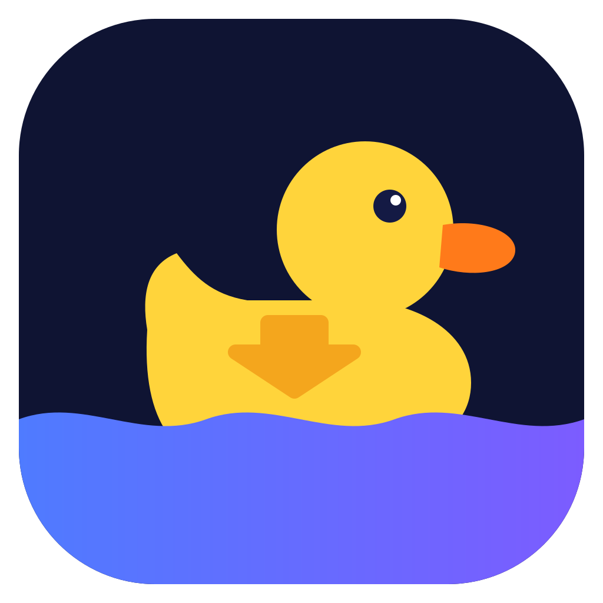
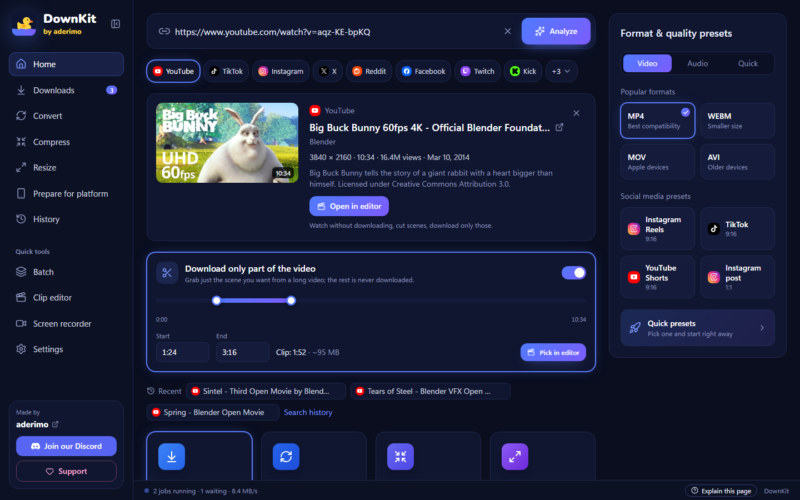
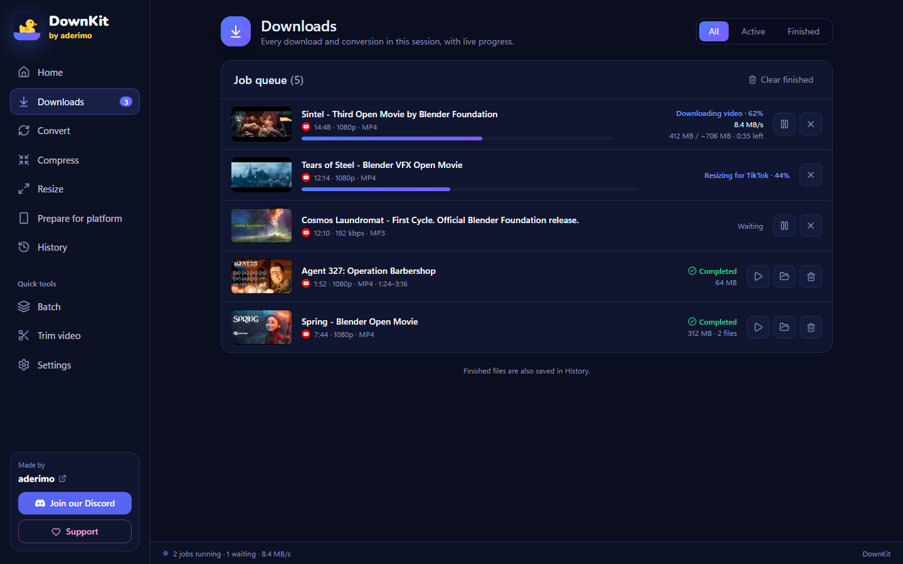
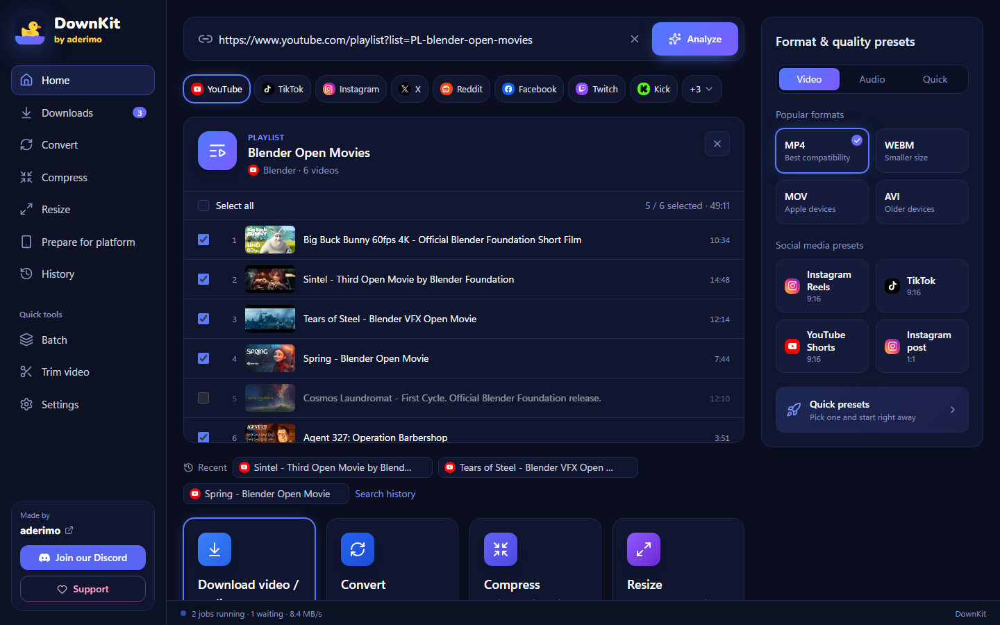
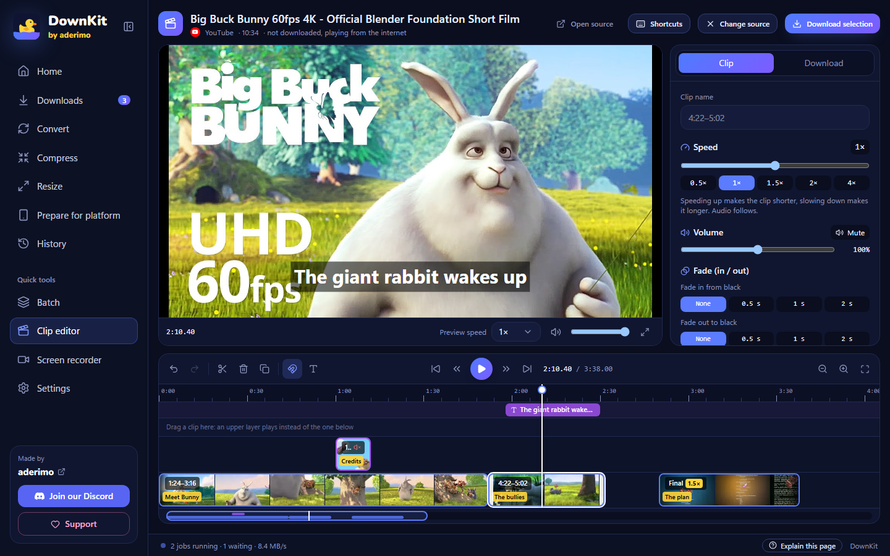
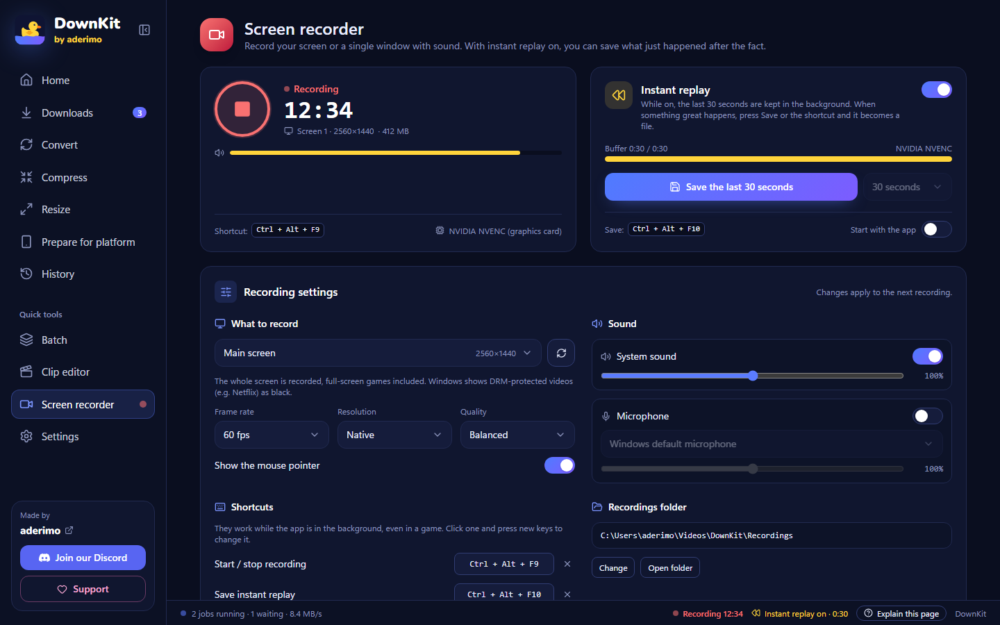
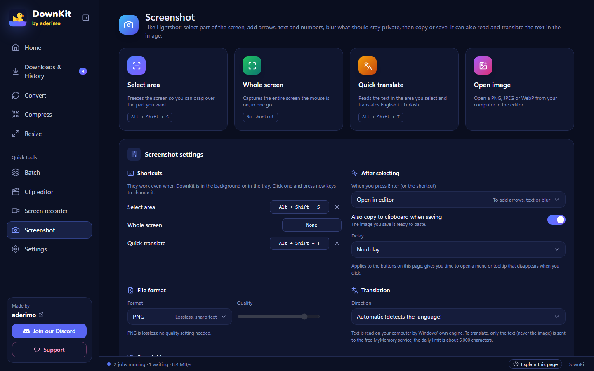
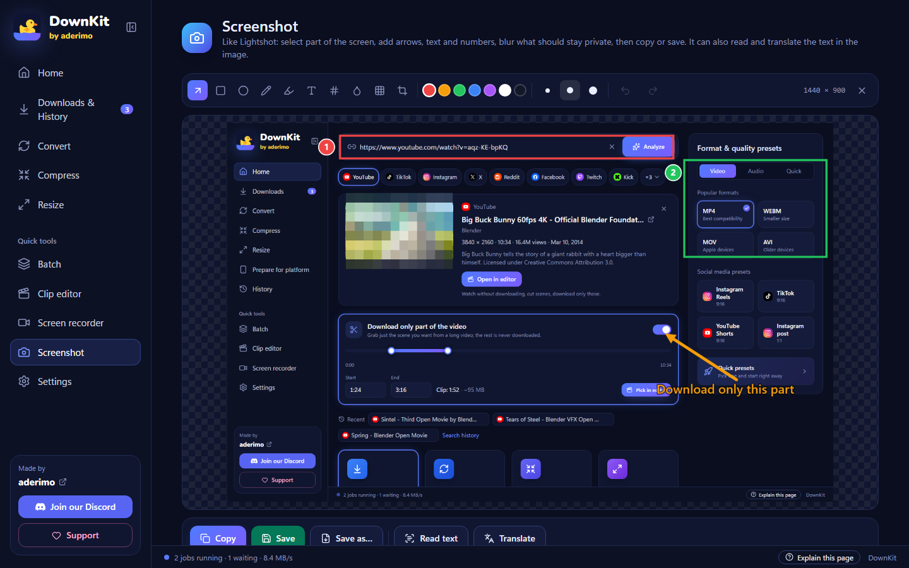
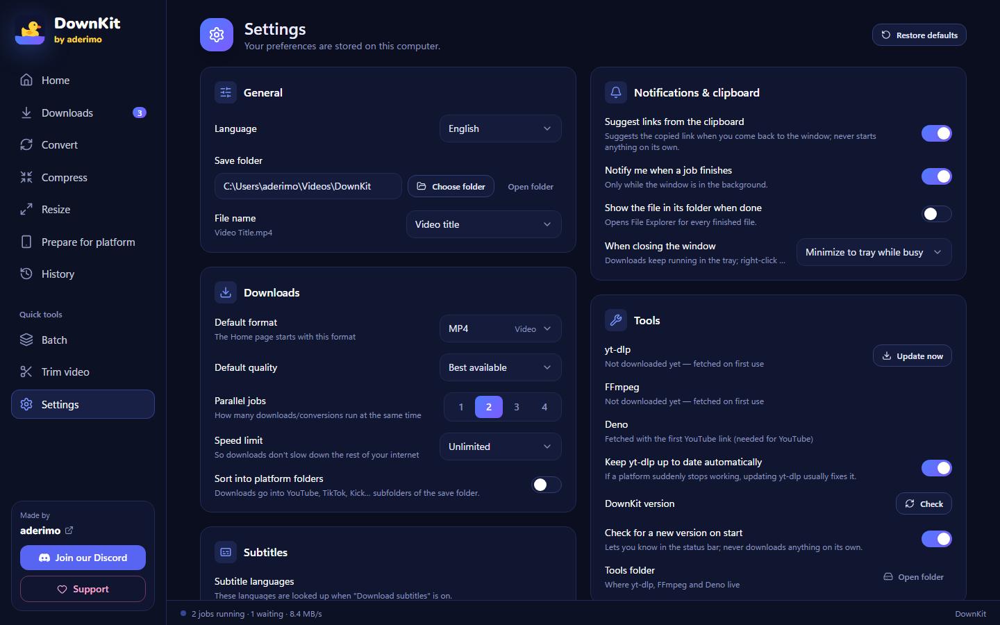

<div align="center">



# DownKit

**Download. Convert. Compress. Prepare.**

[](../../releases)
[](LICENSE)
[](#install)
[](https://discord.gg/z72EaBazJG)

A free, open-source media tool for Windows. Paste a link from YouTube, TikTok, Instagram,
X, Kick and more — get exactly the file you need, even just **one scene of an hour-long video**.

**English** · [Türkçe](README.tr.md)

</div>



---

## Why

Most downloaders give you "a video file". Then you still need three other tools: one to cut
the part you wanted, one to make it small enough for Discord, one to turn it vertical for
TikTok. DownKit does all of that in one place, without codecs, bitrates or command lines:

- **Download only the part you want** — pick 1:24–3:16 of a one-hour video; the rest is never downloaded.
- **See it before you cut it** — the clip editor plays a video without downloading it. Split it
  with **S**, delete what you don't want, change the speed, and download only what's left:
  merged or separately, as video, audio or a GIF.
- **Ready for the platform** — one click adds a 1080×1920 copy for TikTok, Reels or Shorts.
- **Small enough to share** — a compressed copy that fits under Discord's 10 MB limit.
- **Record your screen** — or save the last 30 seconds after something great happened, like
  NVIDIA's Instant Replay.
- **Take screenshots like Lightshot** — select an area with **Alt+Shift+S**, add arrows, text and
  numbered steps, blur what's private, then copy or save. It can even read and translate the
  text in the picture.
- **Honest progress** — percent, speed, size and time left, stage by stage.

Free forever. No ads, no account, no telemetry.

---

## Install

### Requirements

|          |                                                       |
| -------- | ----------------------------------------------------- |
| OS       | Windows 10 or 11 (64-bit)                             |
| WebView2 | Already part of Windows 10/11                         |
| Internet | Needed on first launch to fetch the tools (see below) |

### Steps

1. Open [Releases](../../releases) and download **one** of these:
   - **`DownKit-Setup.exe`** — the installer (English or Turkish, follows your Windows language).
     Installs for your user only, **no admin prompt**, and the last page has a
     **Create desktop shortcut** checkbox.
   - **`DownKit.exe`** — portable: double-click and it runs. Nothing is installed.
2. Run it.

> **"Windows protected your PC"?** The exe isn't code-signed yet, so SmartScreen warns about
> any new app. Click **More info → Run anyway**. The full source is here and every release
> is built by GitHub Actions from this repository.

### What happens on first launch

DownKit doesn't bundle its engines, so they stay up to date. On first launch it downloads them
in the background **from their official GitHub releases** (about 245 MB, once); the bottom bar
shows the progress:

| Tool                                            | What for                                                                             | Size   |
| ----------------------------------------------- | ------------------------------------------------------------------------------------ | ------ |
| [yt-dlp](https://github.com/yt-dlp/yt-dlp)      | Reads links and downloads media                                                      | 17 MB  |
| [FFmpeg](https://github.com/BtbN/FFmpeg-Builds) | Merging, converting, compressing, cutting                                            | 187 MB |
| [Deno](https://github.com/denoland/deno)        | Needed by yt-dlp for YouTube; fetched with the first YouTube link, checksum-verified | 41 MB  |

yt-dlp updates itself every few days (you can turn that off in Settings). Platforms change
often; an up-to-date yt-dlp is what keeps downloads working.

---

## How to use

On first launch a short tour shows where everything is. Tick **Don't show again** to hide it,
or reopen it any time with **Settings → Start the tour**. The first time you open a page, a
second tour explains what's on it step by step; **Explain this page** in the bottom bar shows it
again. Need more room? **Collapse menu** at the top of the sidebar shrinks it to icons.

### 1 · Paste a link

Copy a link and press **Ctrl+V** on the Home page (or paste it into the bar and press
**Analyze**). You'll see the title, channel, length, resolution and — when the platform
allows it — an in-app preview.

> DownKit also notices supported links in your clipboard and offers them. It never starts
> anything by itself.

### 2 · Pick what you want

- **Format:** MP4, WebM, MKV, MOV, AVI — or audio only: MP3, M4A, WAV, AAC, FLAC.
- **Quality:** every option shows its estimated file size.
- **Presets** on the right: best quality, MP3, small file, Discord-friendly, ready for TikTok.
- Optional: subtitles, a vertical copy for platforms, a compressed copy.

### 3 · (Optional) Download only part of the video

Turn on **Download only part of the video** and drag the two handles, or type the times
(`1:24`, `1:02:03`). Even easier: **Pick in editor** — watch the video in the
[clip editor](#clip-editor) and mark the scene there.

The file is named after the range, e.g. `Video (01.24-03.16).mp4`, and the cut is
frame-accurate.

### 4 · Download

Press **Download** (or **Enter**). The job joins the queue with live progress:



When it's done you get **Open file** and **Show in folder**. If the window is in the
background, Windows notifies you. You can pause and resume downloads; closing the app while
jobs are running sends it to the tray, and unfinished downloads come back paused next time.

### Send from your browser

**Settings → Send from your browser** has two bookmarks. Save one in your browser's bookmarks
bar; on a video page, click it and the link opens in DownKit — analyzed on Home, or straight in
the clip editor. Nothing is downloaded by itself.

### Playlists

Paste a playlist link and tick the videos you want:



### Clip editor

Want several scenes, or need to _see_ a scene before cutting it? Press **Open in editor** on
the Home page — or open **Clip editor** in the sidebar and paste a link or drop a file.



- The video **plays without being downloaded**: jump anywhere in an hour-long video within seconds.
- **Cut it like in a video editor.** The video starts as one clip. Move the playhead (the white
  line) to where a scene starts and press **S** to split; do the same at its end. Click the part
  you don't want and press **Delete**. Gaps are skipped when you export.
- **Trim and move.** Drag a clip's edge to shorten or extend it, drag its middle to move it.
  Drop it on the empty row above to put it on a higher layer: while it plays, it's shown
  _instead of_ the clip below (up to 3 layers).
- **Speed** from 0.25× to 4× per clip, sound included — in the clip panel or the right-click menu.
- **Undo / redo** (Ctrl+Z / Ctrl+Y) and a **magnet** that snaps edges to the playhead and other
  clips (hold **Alt** to bypass it). The timeline shows frames and the waveform, for links too;
  **Ctrl + wheel** zooms and the thin bar below is a map of the whole video.
- **Export:** video (MP4 / MKV / WebM, any quality), **audio** (MP3 / M4A / WAV / FLAC) or a
  silent, looping **GIF** (frame rate and width to choose); merged into one file or saved
  separately. From a link, **only the parts you kept are downloaded**, and a paused export
  resumes without downloading finished parts again.
- **Volume and fades:** mute a clip (**M**) or set its volume up to 200%, and fade it in from
  or out to black; picture and sound fade together.
- **Vertical or square output:** pick 9:16 (TikTok, Reels, Shorts), 1:1, 4:5 or 16:9 in the
  export panel; a yellow frame in the preview shows what's kept and can be dragged. Or fit the
  whole picture with black bars.
- **Text:** the **T** button adds a title or caption at the playhead. Set the text, size, color
  and background in the side panel, drag it into place in the preview, and set its timing with
  the purple block on the timeline.
- **Chapters:** YouTube chapters (and MKV/MP4 chapter marks) show on the clips as yellow marks
  and in a list you can jump through; **Split by chapters** turns every chapter into its own
  named clip.
- Your timeline is saved as you work: after closing the app, the editor offers to **Continue**
  the last project.

| Key (default)           | Action                                   |
| ----------------------- | ---------------------------------------- |
| Space / K               | Play / pause                             |
| ← / →                   | Back / forward 1 second                  |
| J / L, Shift + ← / →    | Back / forward 5 seconds                 |
| , / .                   | One frame back / forward                 |
| S                       | Split at the playhead                    |
| Delete                  | Delete the selected clip or text         |
| M                       | Mute / unmute the clip                   |
| Q / W                   | Cut the clip before / after the playhead |
| Ctrl + D                | Duplicate                                |
| Ctrl + Z / Ctrl + Y     | Undo / redo                              |
| + / − / 0, Ctrl + wheel | Zoom in / out / show all                 |

Every shortcut can be changed: press **Shortcuts** in the editor header, then **+** next to an
action to add a key or **×** on a key to remove it.

### Screen recorder

Open **Screen recorder** in the sidebar.



- **Record** your whole screen (full-screen games included) or a single window, with the
  system sound and your microphone, each with its own level. Press the red button or
  **Ctrl + Alt + F9**; when you stop, the recording is saved as an MP4.
- **Instant replay:** while it's on, the last 15 seconds to 5 minutes are kept in the
  background. When something great happens, press **Save** or **Ctrl + Alt + F10** and those
  seconds become a file. Like NVIDIA's instant replay, the buffer then starts again from zero, so
  the next save never repeats the last one. **Ctrl + Alt + Shift + F10** turns it on or off; it
  can also start with the app. It runs alongside a normal recording.
- The shortcuts work while DownKit is in the background, even in a game, and can be changed;
  a small notice in the corner of the screen confirms each one (it never takes focus and doesn't
  appear in recordings). Any combination can be assigned, even one another program holds; DownKit
  warns you and takes it over once that program lets go.
  Video is compressed on the graphics card (NVIDIA NVENC, AMD AMF or Intel Quick Sync, whichever
  works), so games barely slow down; without one, the CPU does it.
- **My recordings:** every recording with a thumbnail. Click one to watch it in the app, then
  **Open in editor**, rename, show in folder or delete it (to the Recycle Bin). A recording cut
  off by a crash can be repaired into an MP4.

Picture and sound stay in sync: in a test with a flash and a beep every second, sound landed
within 14–24 ms of the picture on screen recordings.

### Screenshot

Open **Screenshot** in the sidebar — or just press **Alt + Shift + S** anywhere, even with
DownKit in the tray (also in the tray menu: **Take screenshot**).



- **Select area** freezes the screen: drag over the part you want. **Enter** takes the whole
  screen, **Esc** cancels, right-click clears the selection. A toolbar under the selection offers
  **Edit**, **Translate**, **Copy** (Ctrl+C) and **Save** (Ctrl+S).
- **Whole screen** grabs the screen the mouse is on in one go (no default shortcut; assign one if
  you like). **Open image** edits a PNG, JPEG or WebP from your computer.
- **Delay** (3, 5 or 10 s) gives you time to open a menu or tooltip before the capture.



- **Editor:** arrow, rectangle, ellipse, pen, highlighter, text, **numbered steps**, **blur**,
  **pixelate** and **crop**, in 7 colors and 3 thicknesses, with undo / redo. Everything is
  drawn at full resolution: what you see is exactly what's saved.
- **Copy, save or save as** PNG (lossless), JPEG or WebP (quality slider). With **Also copy to
  clipboard when saving** on, a saved screenshot is ready to paste in Discord or WhatsApp.
- **Read text** pulls the text out of the image (Windows' own OCR, offline).
  **Quick translate** (**Alt + Shift + T**) reads a selected area and translates English ↔ Turkish,
  placing the translation over the original text — handy for games and apps in another language.
- **Settings** on the same page: shortcuts, what Enter does (open in editor, copy or save), file
  format, save folder (**Pictures\DownKit** by default) and translation direction.
- **My screenshots:** your saved images with thumbnails; open one in the editor, copy it, show it
  in its folder or delete it (to the Recycle Bin).

| Key (default)       | Action                                                                      |
| ------------------- | --------------------------------------------------------------------------- |
| Alt + Shift + S     | Select an area                                                              |
| Alt + Shift + T     | Quick translate                                                             |
| A R E P H T N B X C | Arrow, rectangle, ellipse, pen, highlight, text, step, blur, pixelate, crop |
| Ctrl + Z / Ctrl + Y | Undo / redo                                                                 |
| Ctrl + C / Ctrl + S | Copy / save (Ctrl + Shift + S: save as)                                     |

### Files on your computer

Drag a file onto the window, or use the tools in the sidebar:

- **Convert** — change the format. When the codecs already fit (e.g. an H.264 MKV to MP4) the
  streams are copied instead of re-encoded: seconds, no quality loss.
- **Compress** — by quality level or target size in MB. "Small file" also drops to 720p / 30 fps.
- **Resize / Prepare for platform** — any resolution or aspect ratio; crop to fill or fit with bars.
- **Clip editor** — works with local files too: _Fast_ cuts take seconds without re-encoding
  (the cut may shift to the nearest keyframe), _Frame-accurate_ re-encodes. Files the preview
  can't play (e.g. old AVI) get a lightweight preview copy; exports always use the original.

The original file is never changed; results are saved as new files.

---

## Features

**From a link**

- YouTube, TikTok, Instagram, X, Reddit, Facebook, Twitch, Kick, Vimeo, Dailymotion, Pinterest — and anything else yt-dlp supports
- Download just a section of a video (drag handles, time boxes or mark it while watching)
- Clip editor: watch without downloading; split, delete, trim, layers, speed, volume, fades, text, chapters, undo; export merged or separately as video, audio or GIF, also vertical (9:16) or square
- Optional SponsorBlock: sponsor, self-promotion and "subscribe" parts are cut from YouTube downloads
- Playlists (up to 500 videos per list) and batch mode (paste many links; duplicates are skipped)
- Subtitles in the languages you choose, saved as `.srt`; a subtitle the platform refuses doesn't stop the video
- Title, channel and date are written into the file; MP3 / M4A / FLAC also get the cover art, so music players show them properly
- Platform copies (Reels, TikTok, Shorts 9:16 · YouTube 16:9 · Instagram post 1:1) and compressed copies

**Screen recorder**

- Screen or window, system sound and microphone, hardware encoding
- Instant replay (last 15 s – 5 min) with a system-wide shortcut
- In-app library: watch, open in editor, rename, delete, repair

**Screenshot**

- Area, whole screen or an image file; system-wide shortcuts and a tray menu item; optional delay
- Arrow, shapes, pen, highlighter, text, numbered steps, blur, pixelate, crop; undo / redo
- Copy, save, save as PNG / JPEG / WebP; offline text recognition and English ↔ Turkish translation drawn on the image
- In-app library of saved screenshots

**Queue**

- Live percent, speed, downloaded / total size, time left and stage (video → audio → merging)
- Pause / resume, cancel (partial files are cleaned up), retry — a temporary platform hiccup is retried once automatically
- Parallel jobs (1–4) and an optional speed limit
- Survives restarts; closing while busy minimizes to the tray
- Taskbar progress and a notification when a job finishes in the background

**Everything else**

- History of finished files and searched links
- Friendly error messages (private, age-restricted, region-blocked, rate-limited, channel offline, disk full…)
- Default format and quality, file name templates, optional per-platform folders
- Turkish and English interface
- One window only: opening DownKit again brings the existing window forward
- One-click updates for installed copies (nothing installs until you press it); the portable exe opens the release page
- Guided tours for every page, a collapsible sidebar and editable editor shortcuts
- 16 color themes under **Settings → Theme**: 12 dark (including an OBS-style grey, pitch black, pink, red, purple and green) and 4 light
- **Report this** next to an error copies a report (version, error, technical details — without your user name) to paste on Discord or GitHub
- Send links from your browser with a bookmark (`downkit://` link)
- An error log on your computer (**Settings → Error log**); **Report this** adds its last lines



---

## Troubleshooting

| Problem                                                     | Cause and fix                                                                                                                                                                                                       |
| ----------------------------------------------------------- | ------------------------------------------------------------------------------------------------------------------------------------------------------------------------------------------------------------------- |
| **"Windows protected your PC"**                             | The exe isn't code-signed yet. **More info → Run anyway.**                                                                                                                                                          |
| **A site suddenly stopped working**                         | Platforms change often. **Settings → Tools → yt-dlp → Update now.**                                                                                                                                                 |
| **"The platform received too many requests"**               | Rate limiting (HTTP 429). Wait a few minutes. For subtitles, turning off _Also download automatic subtitles_ helps.                                                                                                 |
| **"This video is private / age-restricted / members-only"** | DownKit doesn't bypass access restrictions — those videos can't be downloaded.                                                                                                                                      |
| **"This channel isn't live right now"** (Kick, Twitch)      | Paste a link to a past broadcast (VOD) or clip instead.                                                                                                                                                             |
| **The first download takes a while to start**               | The tools are being downloaded once (≈245 MB); the bottom bar shows the progress.                                                                                                                                   |
| **Something went wrong**                                    | Press **Report this** next to the error and paste the report on Discord or in an issue.                                                                                                                             |
| **A recorder shortcut doesn't work**                        | Another program (often the NVIDIA app: Alt+F9, Alt+F10, Alt+Z) already uses that key; DownKit says so next to the shortcut. Turn it off in that program (DownKit takes it over within seconds) or pick another one. |
| **A video is black in the recording**                       | Windows hides DRM-protected video (e.g. Netflix) from screen capture. DownKit doesn't get around that.                                                                                                              |
| **A window recording freezes**                              | A minimized window can't be recorded. Keep it open, or record the screen instead.                                                                                                                                   |
| **"Couldn't read the text in the image"**                   | Windows reads text with the language packs installed on your PC. Add the language under **Windows Settings → Time & language → Language**.                                                                          |
| **"Today's free translation limit is used up"**             | The free translation service allows about 5,000 characters a day. Reading text (OCR) still works; translation is back tomorrow.                                                                                     |
| **Where are my files?**                                     | The save folder shown next to the **Download** button, or **Settings → Save folder**. Every finished job has **Show in folder**.                                                                                    |
| **A clip cut from a local file starts a bit early**         | _Fast_ cuts at keyframes. Choose _Frame-accurate_ in the export panel.                                                                                                                                              |
| **The editor preview doesn't play**                         | Links are only valid for a few hours — press **Try again**. For local files, use **Create preview copy**.                                                                                                           |

Still stuck? Ask on [Discord](https://discord.gg/z72EaBazJG) or [open an issue](../../issues).

---

## Privacy and legal

- No account, no analytics, no telemetry. DownKit only talks to the sites you paste links
  from and to GitHub (to download its tools and to check for a new version).
- The clip editor's preview relay listens only on `127.0.0.1` and serves only what you opened.
- Settings, history, the queue and your recordings stay on your computer. The screen recorder
  captures only what you start it for; nothing is uploaded.
- If you turn on **SponsorBlock**, a short hash derived from the video ID is sent to
  sponsor.ajay.app to look up sponsor segments.
- Screenshots stay on your computer. Text recognition runs offline; only when you press
  **Translate**, the recognized text (never the image) is sent to the free
  [MyMemory](https://mymemory.translated.net/) service.
- **DownKit does not break DRM or bypass access restrictions.** Only download content you have
  the right to download, or that the platform's terms allow. Responsibility for what you
  download is yours.

---

## Support

DownKit is free and will stay free. If it saves you time and you'd like to say thanks,
you can support it with a **voluntary donation**:

**[Donate](https://donate.bynogame.com/aderimo)** · **[Discord](https://discord.gg/z72EaBazJG)** · **[aderimo](https://gitgit.me/aderimo)**

---

## Development

Requirements: [Node.js](https://nodejs.org/) 22+, [pnpm](https://pnpm.io/) (`corepack enable`),
[Rust](https://rustup.rs/) and, on Windows, the _Desktop development with C++_ workload from
[Visual Studio Build Tools](https://visualstudio.microsoft.com/visual-cpp-build-tools/).

```bash
pnpm install
pnpm tauri dev          # run the app
pnpm typecheck && pnpm lint && pnpm test && pnpm format:check
pnpm test:e2e           # interface flows in Edge (Playwright, demo scenes)
cd src-tauri && cargo test
```

Windows shortcuts: `baslat.bat` runs all checks and starts the app; `paketle.bat` builds
`DownKit.exe` and `DownKit-Setup.exe` into the project folder.

| Path                       | Responsibility                                                                    |
| -------------------------- | --------------------------------------------------------------------------------- |
| `src/`                     | React + TypeScript interface (screens, job engine, translations in `src/locales`) |
| `src-tauri/src/commands/`  | Tauri commands: analyze, download, convert, compress, resize, clip editor         |
| `src-tauri/src/preview.rs` | Local 127.0.0.1 relay for in-app previews (HLS rewriting, file ranges)            |
| `src-tauri/src/recorder/`  | Screen recorder: WASAPI audio, mixer, instant replay ring, recordings library     |
| `src-tauri/src/snip/`      | Screenshot: area selection window, OCR (Windows.Media.Ocr), translation, library  |
| `src-tauri/src/ytdlp/`     | yt-dlp, Deno and friendly error mapping                                           |
| `src-tauri/src/ffmpeg/`    | FFmpeg argument builders (pure functions, unit-tested)                            |
| `branding/`                | Icon source (`icon.svg`) and installer images                                     |
| `docs/screenshots/`        | README screenshots (dev server with `?demo=home&lang=en`)                         |

Releases: push a tag like `v0.1.0` and [the release workflow](.github/workflows/release.yml)
builds the installer, the portable exe and the signed update manifest and attaches them to a
draft release. The full checklist (update key, code signing, winget) is in
[docs/RELEASING.md](docs/RELEASING.md).

Contributions are welcome, and so are translations: one JSON file per language — see
[CONTRIBUTING.md](CONTRIBUTING.md). Comments, commit messages and tests in this repository are
written in Turkish; English is fine for issues and pull requests.

---

## License

[MIT](LICENSE) © 2026 aderimo — use, modify and redistribute freely; keep the copyright notice.
The name "DownKit" and the duck logo belong to aderimo: if you publish a modified version, give it
its own name and icon ([TRADEMARKS.md](TRADEMARKS.md)). DownKit's original author is aderimo;
how to recognize an original build is in [AUTHORS.md](AUTHORS.md). Licenses of the components
DownKit uses: [THIRD_PARTY_NOTICES.md](THIRD_PARTY_NOTICES.md).

DownKit is an independent tool built on [yt-dlp](https://github.com/yt-dlp/yt-dlp) (Unlicense),
[FFmpeg](https://ffmpeg.org/legal.html) (LGPL/GPL, run as a separate program),
[Deno](https://github.com/denoland/deno) (MIT) and [Tauri](https://tauri.app/) (MIT/Apache-2.0).
Brand icons from [Simple Icons](https://simpleicons.org/) (CC0), font
[Nunito](https://fonts.google.com/specimen/Nunito) (OFL).
Screenshots show open movies by the [Blender Foundation](https://studio.blender.org/films/) (CC BY).

<div align="center">

Made by · **[aderimo](https://gitgit.me/aderimo)**

</div>
