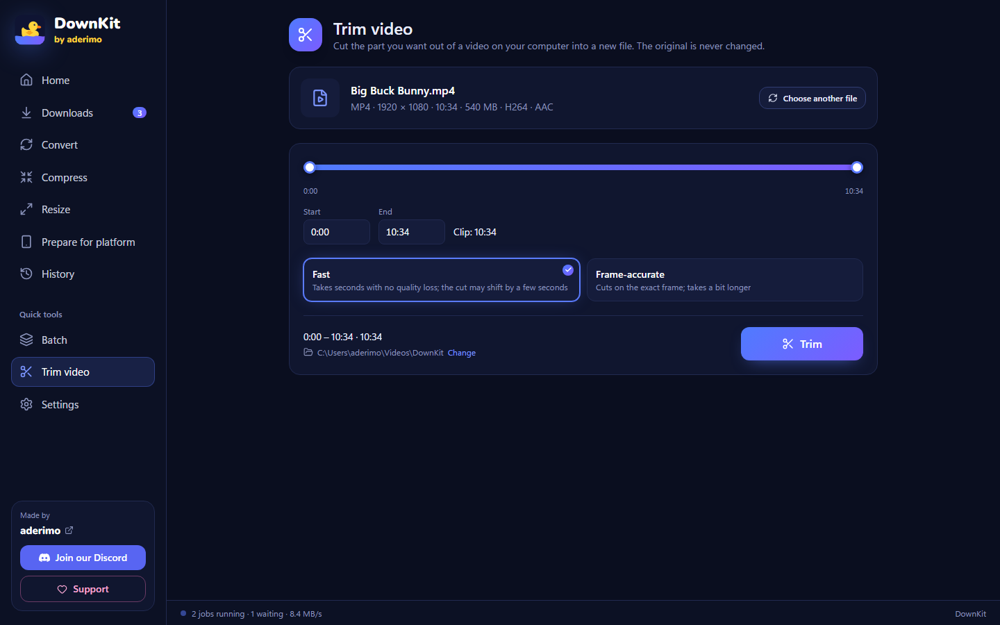

<div align="center">


# DownKit

**Download. Convert. Compress. Prepare.**

[](../../releases)
[](LICENSE)
[](#install)
[](https://discord.gg/z72EaBazJG)

A free, open-source media tool for Windows. Paste a link from YouTube, TikTok, Instagram,
X, Kick and more — get exactly the file you need, even just **one scene of an hour-long video**.

**English** · [Türkçe](README.tr.md)

</div>


---

## Why

Most downloaders give you "a video file". Then you still need three other tools: one to cut
the part you wanted, one to make it small enough for Discord, one to turn it vertical for
TikTok. DownKit does all of that in one place, without codecs, bitrates or command lines:

- **Download only the part you want** — pick 1:24–3:16 of a one-hour video; the rest is never downloaded.
- **Ready for the platform** — one click adds a 1080×1920 copy for TikTok, Reels or Shorts.
- **Small enough to share** — a compressed copy that fits under Discord's 10 MB limit.
- **Honest progress** — percent, speed, size and time left, stage by stage.

Free forever. No ads, no account, no telemetry.

---

## Install

### Requirements

|          |                                                       |
| -------- | ----------------------------------------------------- |
| OS       | Windows 10 or 11 (64-bit)                             |
| WebView2 | Already part of Windows 10/11                         |
| Internet | Needed on first launch to fetch the tools (see below) |

### Steps

1. Open [Releases](../../releases) and download **one** of these:
   - **`DownKit-Setup.exe`** — the installer (English or Turkish, follows your Windows language).
     Installs for your user only, **no admin prompt**, and the last page has a
     **Create desktop shortcut** checkbox.
   - **`DownKit.exe`** — portable: double-click and it runs. Nothing is installed.
2. Run it.

> **"Windows protected your PC"?** The exe isn't code-signed yet, so SmartScreen warns about
> any new app. Click **More info → Run anyway**. The full source is here and every release
> is built by GitHub Actions from this repository.

### What happens on first launch

DownKit doesn't bundle its engines, so they stay up to date. The first time they're needed
it downloads them **from their official GitHub releases** (about 245 MB, once):

| Tool                                            | What for                                                                             | Size   |
| ----------------------------------------------- | ------------------------------------------------------------------------------------ | ------ |
| [yt-dlp](https://github.com/yt-dlp/yt-dlp)      | Reads links and downloads media                                                      | 17 MB  |
| [FFmpeg](https://github.com/BtbN/FFmpeg-Builds) | Merging, converting, compressing, cutting                                            | 187 MB |
| [Deno](https://github.com/denoland/deno)        | Needed by yt-dlp for YouTube; fetched with the first YouTube link, checksum-verified | 41 MB  |

yt-dlp updates itself every few days (you can turn that off in Settings). Platforms change
often; an up-to-date yt-dlp is what keeps downloads working.

---

## How to use

### 1 · Paste a link

Copy a link and press **Ctrl+V** on the Home page (or paste it into the bar and press
**Analyze**). You'll see the title, channel, length, resolution and — when the platform
allows it — an in-app preview.

> DownKit also notices supported links in your clipboard and offers them. It never starts
> anything by itself.

### 2 · Pick what you want

- **Format:** MP4, WebM, MKV, MOV, AVI — or audio only: MP3, M4A, WAV, AAC, FLAC.
- **Quality:** every option shows its estimated file size.
- **Presets** on the right: best quality, MP3, small file, Discord-friendly, ready for TikTok.
- Optional: subtitles, a vertical copy for platforms, a compressed copy.

### 3 · (Optional) Download only part of the video

Turn on **Download only part of the video** and drag the two handles, or type the times
(`1:24`, `1:02:03`). Even easier: **Pick in preview** — play the video and press
**Start = now** / **End = now**.

The file is named after the range, e.g. `Video (01.24-03.16).mp4`, and the cut is
frame-accurate.

### 4 · Download

Press **Download** (or **Enter**). The job joins the queue with live progress:


When it's done you get **Open file** and **Show in folder**. If the window is in the
background, Windows notifies you. You can pause and resume downloads; closing the app while
jobs are running sends it to the tray, and unfinished downloads come back paused next time.

### Playlists

Paste a playlist link and tick the videos you want:


### Files on your computer

Drag a file onto the window, or use the tools in the sidebar:

- **Convert** — change the format. When the codecs already fit (e.g. an H.264 MKV to MP4) the
  streams are copied instead of re-encoded: seconds, no quality loss.
- **Compress** — by quality level or target size in MB. "Small file" also drops to 720p / 30 fps.
- **Resize / Prepare for platform** — any resolution or aspect ratio; crop to fill or fit with bars.
- **Trim video** — cut a range out of a local video: _Fast_ (seconds, no re-encoding, the cut may
  shift a few seconds to the nearest keyframe) or _Frame-accurate_.



The original file is never changed; results are saved as new files.

---

## Features

**From a link**

- YouTube, TikTok, Instagram, X, Reddit, Facebook, Twitch, Kick, Vimeo, Dailymotion, Pinterest — and anything else yt-dlp supports
- Download just a section of a video (drag handles, time boxes or mark it while watching the preview)
- Playlists (up to 500 videos per list) and batch mode (paste many links; duplicates are skipped)
- Subtitles in the languages you choose, saved as `.srt`; a subtitle the platform refuses doesn't stop the video
- Platform copies (Reels, TikTok, Shorts 9:16 · YouTube 16:9 · Instagram post 1:1) and compressed copies

**Queue**

- Live percent, speed, downloaded / total size, time left and stage (video → audio → merging)
- Pause / resume, cancel (partial files are cleaned up), retry
- Parallel jobs (1–4) and an optional speed limit
- Survives restarts; closing while busy minimizes to the tray
- Taskbar progress and a notification when a job finishes in the background

**Everything else**

- History of finished files and searched links
- Friendly error messages (private, age-restricted, region-blocked, rate-limited, channel offline, disk full…)
- Default format and quality, file name templates, optional per-platform folders
- Turkish and English interface
- One window only: opening DownKit again brings the existing window forward
- Tells you when a new version is out (never installs anything by itself)


---

## Troubleshooting

| Problem                                                     | Cause and fix                                                                                                                    |
| ----------------------------------------------------------- | -------------------------------------------------------------------------------------------------------------------------------- |
| **"Windows protected your PC"**                             | The exe isn't code-signed yet. **More info → Run anyway.**                                                                       |
| **A site suddenly stopped working**                         | Platforms change often. **Settings → Tools → yt-dlp → Update now.**                                                              |
| **"The platform received too many requests"**               | Rate limiting (HTTP 429). Wait a few minutes. For subtitles, turning off _Also download automatic subtitles_ helps.              |
| **"This video is private / age-restricted / members-only"** | DownKit doesn't bypass access restrictions — those videos can't be downloaded.                                                   |
| **"This channel isn't live right now"** (Kick, Twitch)      | Paste a link to a past broadcast (VOD) or clip instead.                                                                          |
| **The first download takes a while to start**               | The tools are being downloaded once (≈245 MB).                                                                                   |
| **Where are my files?**                                     | The save folder shown next to the **Download** button, or **Settings → Save folder**. Every finished job has **Show in folder**. |
| **A trimmed clip starts a bit early**                       | _Fast_ trim cuts at keyframes. Use _Frame-accurate_.                                                                             |

Still stuck? Ask on [Discord](https://discord.gg/z72EaBazJG) or [open an issue](../../issues).

---

## Privacy and legal

- No account, no analytics, no telemetry. DownKit only talks to the sites you paste links
  from and to GitHub (to download its tools and to check for a new version).
- Settings, history and the queue stay on your computer.
- **DownKit does not break DRM or bypass access restrictions.** Only download content you have
  the right to download, or that the platform's terms allow. Responsibility for what you
  download is yours.

---

## Support

DownKit is free and will stay free. If it saves you time and you'd like to say thanks,
you can support it with a **voluntary donation**:

**[Donate](https://donate.bynogame.com/aderimo)** · **[Discord](https://discord.gg/z72EaBazJG)** · **[aderimo](https://gitgit.me/aderimo)**

---

## Development

Requirements: [Node.js](https://nodejs.org/) 22+, [pnpm](https://pnpm.io/) (`corepack enable`),
[Rust](https://rustup.rs/) and, on Windows, the _Desktop development with C++_ workload from
[Visual Studio Build Tools](https://visualstudio.microsoft.com/visual-cpp-build-tools/).

```bash
pnpm install
pnpm tauri dev          # run the app
pnpm typecheck && pnpm lint && pnpm test && pnpm format:check
cd src-tauri && cargo test
```

Windows shortcuts: `baslat.bat` runs all checks and starts the app; `paketle.bat` builds
`DownKit.exe` and `DownKit-Setup.exe` into the project folder.

| Path                      | Responsibility                                                                    |
| ------------------------- | --------------------------------------------------------------------------------- |
| `src/`                    | React + TypeScript interface (screens, job engine, translations in `src/locales`) |
| `src-tauri/src/commands/` | Tauri commands: analyze, download, convert, compress, resize, trim                |
| `src-tauri/src/ytdlp/`    | yt-dlp, Deno and friendly error mapping                                           |
| `src-tauri/src/ffmpeg/`   | FFmpeg argument builders (pure functions, unit-tested)                            |
| `branding/`               | Icon source (`icon.svg`) and installer images                                     |
| `docs/screenshots/`       | README screenshots (dev server with `?demo=home&lang=en`)                         |

Releases: push a tag like `v0.1.0` and [the release workflow](.github/workflows/release.yml)
builds the installer and portable exe and attaches them to a draft release.

Contributions are welcome. Comments, commit messages and tests in this repository are written
in Turkish; English is fine for issues and pull requests.

---

## License

[MIT](LICENSE) — use, modify and redistribute freely.

DownKit is an independent tool built on [yt-dlp](https://github.com/yt-dlp/yt-dlp) (Unlicense),
[FFmpeg](https://ffmpeg.org/legal.html) (LGPL/GPL, run as a separate program),
[Deno](https://github.com/denoland/deno) (MIT) and [Tauri](https://tauri.app/) (MIT/Apache-2.0).
Brand icons from [Simple Icons](https://simpleicons.org/) (CC0), font
[Nunito](https://fonts.google.com/specimen/Nunito) (OFL).
Screenshots show open movies by the [Blender Foundation](https://studio.blender.org/films/) (CC BY).

<div align="center">

Made by · **[aderimo](https://gitgit.me/aderimo)**

</div>
