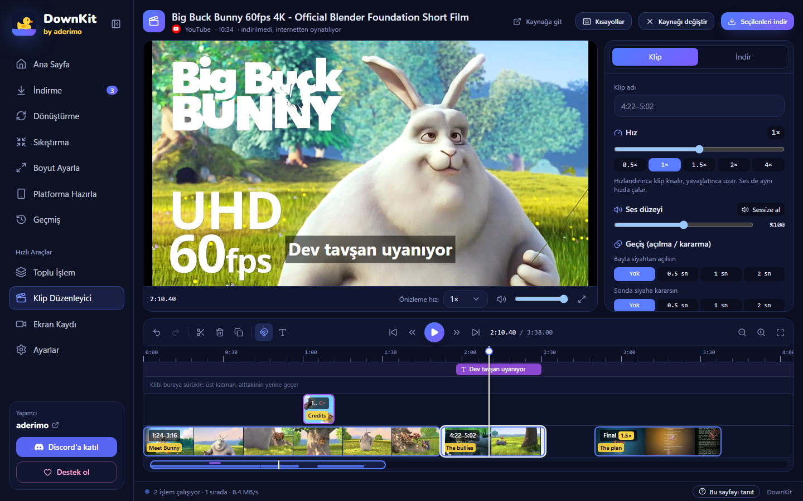
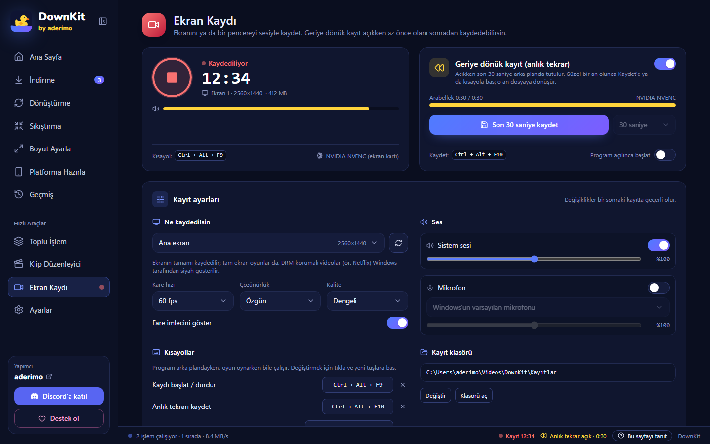
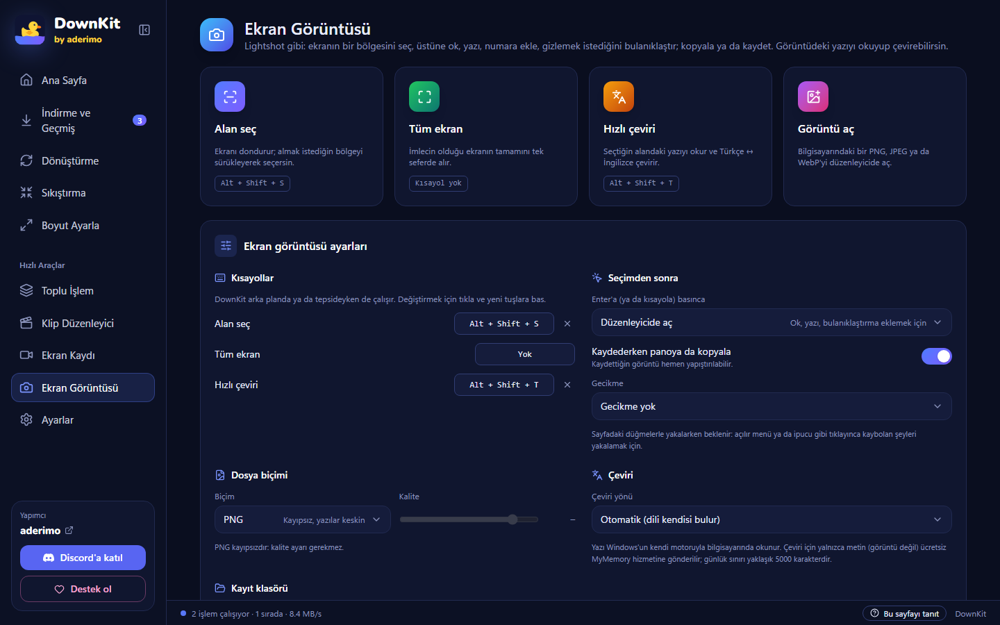
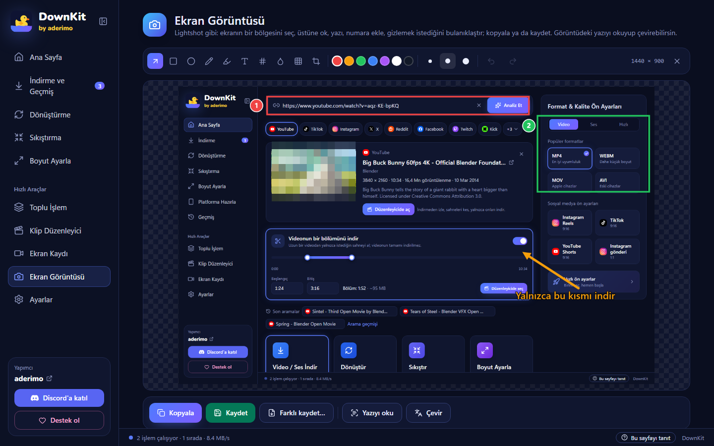

<div align="center">


# DownKit

**İndir. Dönüştür. Sıkıştır. Hazırla.**

[](../../releases)
[](LICENSE)
[](#kurulum)
[](https://discord.gg/z72EaBazJG)

Windows için ücretsiz ve açık kaynak medya aracı. YouTube, TikTok, Instagram, X, Kick ve
daha fazlasından link yapıştır; tam istediğin dosyayı al — **1 saatlik bir videonun sadece
bir sahnesini** bile.

[English](README.md) · **Türkçe**

</div>


---

## Neden

Çoğu indirici sana "bir video dosyası" verir. Sonra üç ayrı araç daha gerekir: istediğin
kısmı kesmek için, Discord'a sığacak kadar küçültmek için, TikTok için dikey yapmak için.
DownKit hepsini tek yerde yapar; codec, bit hızı ya da komut satırı bilmeden:

- **Sadece istediğin kısmı indir** — 1 saatlik videonun 1:24–3:16 arasını seç; gerisi hiç indirilmez.
- **Kesmeden önce gör** — Klip Düzenleyici videoyu indirmeden oynatır. **S** ile böl,
  istemediğin kısmı sil, hızını değiştir ve yalnızca kalanı indir: birleşik ya da ayrı;
  video, ses ya da GIF olarak.
- **Platforma hazır** — tek tıkla TikTok, Reels ya da Shorts için 1080×1920 kopya.
- **Paylaşmaya uygun boyut** — Discord'un 10 MB sınırına sığan sıkıştırılmış kopya.
- **Ekranını kaydet** — ya da güzel bir şey olduktan sonra son 30 saniyeyi kaydet; NVIDIA'nın
  Anlık Tekrar'ı gibi.
- **Lightshot gibi ekran görüntüsü al** — **Alt+Shift+S** ile alan seç, ok, yazı ve numaralı adım
  ekle, gizli kalması gerekeni bulanıklaştır; kopyala ya da kaydet. Görüntüdeki yazıyı okuyup
  çevirebilir de.
- **Dürüst ilerleme** — yüzde, hız, boyut ve kalan süre; aşama aşama.

Sonsuza kadar ücretsiz. Reklam yok, hesap yok, veri toplama yok.

---

## Kurulum

### Gereksinimler

|                 |                                                       |
| --------------- | ----------------------------------------------------- |
| İşletim sistemi | Windows 10 veya 11 (64 bit)                           |
| WebView2        | Windows 10/11 ile zaten geliyor                       |
| İnternet        | İlk açılışta araçları indirmek için gerekli (aşağıda) |

### Adımlar

1. [Releases](../../releases) sayfasını aç ve şunlardan **birini** indir:
   - **`DownKit-Setup.exe`** — kurulum dosyası (Windows diline göre Türkçe ya da İngilizce).
     Yalnızca senin kullanıcına kurar, **yönetici izni istemez**; son sayfada
     **Masaüstü kısayolu oluştur** onay kutusu var.
   - **`DownKit.exe`** — kurulumsuz: çift tıkla, açılır. Hiçbir şey kurulmaz.
2. Çalıştır.

> **"Windows bilgisayarınızı korudu" uyarısı mı çıktı?** Exe henüz dijital olarak
> imzalı değil; SmartScreen her yeni uygulamada bu uyarıyı gösterir. **Ek bilgi → Yine de
> çalıştır**'a tıkla. Kaynak kodun tamamı burada ve her sürüm bu depodan GitHub Actions ile derlenir.

### İlk açılışta ne olur

DownKit motorlarını içinde taşımaz ki hep güncel kalsınlar. İlk açılışta onları arka planda
**resmi GitHub sürümlerinden** indirir (bir kereye mahsus, yaklaşık 245 MB); ilerlemesi alttaki
durum çubuğunda görünür:

| Araç                                            | Ne işe yarar                                                                                                    | Boyut  |
| ----------------------------------------------- | --------------------------------------------------------------------------------------------------------------- | ------ |
| [yt-dlp](https://github.com/yt-dlp/yt-dlp)      | Linkleri okur, medyayı indirir                                                                                  | 17 MB  |
| [FFmpeg](https://github.com/BtbN/FFmpeg-Builds) | Birleştirme, dönüştürme, sıkıştırma, kesme                                                                      | 187 MB |
| [Deno](https://github.com/denoland/deno)        | yt-dlp'nin YouTube için ihtiyaç duyduğu yardımcı; ilk YouTube linkinde indirilir, sağlama toplamıyla doğrulanır | 41 MB  |

yt-dlp birkaç günde bir kendini günceller (Ayarlar'dan kapatılabilir). Platformlar sık
değişir; indirmelerin çalışmaya devam etmesini sağlayan şey güncel bir yt-dlp'dir.

---

## Nasıl kullanılır

İlk açılışta kısa bir tanıtım turu nerede ne olduğunu gösterir. **Bir daha gösterme**'yi
işaretlersen bir daha çıkmaz; **Ayarlar → Turu başlat** ile istediğin zaman yeniden açabilirsin.
Bir sayfayı ilk açtığında ikinci bir tur o sayfadakileri adım adım anlatır; alttaki
**Bu sayfayı tanıt** düğmesi onu yeniden gösterir. Daha çok yer mi lazım? Kenar çubuğunun
üstündeki **Menüyü daralt** onu yalnızca simgelere indirir.

### 1 · Linki yapıştır

Linki kopyala ve Ana Sayfa'da **Ctrl+V**'ye bas (ya da kutuya yapıştırıp **Analiz Et**'e
bas). Başlık, kanal, süre, çözünürlük ve — platform izin veriyorsa — uygulama içi önizleme görünür.

> DownKit panoya kopyaladığın desteklenen linkleri fark edip önerir. Kendiliğinden hiçbir
> şey başlatmaz.

### 2 · Ne istediğini seç

- **Format:** MP4, WebM, MKV, MOV, AVI — ya da sadece ses: MP3, M4A, WAV, AAC, FLAC.
- **Kalite:** her seçeneğin yanında tahmini dosya boyutu yazar.
- Sağdaki **ön ayarlar:** en iyi kalite, MP3, küçük dosya, Discord'a uygun, TikTok'a hazır.
- İsteğe bağlı: altyazı, platformlar için dikey kopya, sıkıştırılmış kopya.

### 3 · (İsteğe bağlı) Videonun sadece bir bölümünü indir

**Videonun bir bölümünü indir**'i aç, iki tutamacı sürükle ya da zamanları yaz (`1:24`,
`1:02:03`). Daha kolayı: **Düzenleyicide seç** — videoyu [Klip Düzenleyici](#klip-düzenleyici)'de
izleyip sahneyi orada işaretle.

Dosya aralığın adıyla kaydedilir, örneğin `Video (01.24-03.16).mp4`; kesim tam karede yapılır.

### 4 · İndir

**İndir**'e (ya da **Enter**'a) bas. İş canlı ilerlemesiyle kuyruğa girer:


Bitince **Dosyayı aç** ve **Klasörde göster** düğmeleri çıkar. Pencere arka plandaysa Windows
bildirimi gelir. İndirmeleri duraklatıp devam ettirebilirsin; işlem sürerken programı
kapatırsan sistem tepsisine iner, yarım kalan indirmeler sonraki açılışta duraklatılmış olarak gelir.

### Tarayıcıdan gönder

**Ayarlar → Tarayıcıdan gönder**'de iki yer imi var. Birini tarayıcının yer imleri çubuğuna
kaydet; bir video sayfasındayken ona tıkla, link DownKit'te açılır — Ana Sayfa'da analiz
edilir ya da doğrudan Klip Düzenleyici'ye gelir. Kendiliğinden hiçbir şey inmez.

### Oynatma listeleri

Liste linkini yapıştır, istediğin videoları işaretle:


### Klip Düzenleyici

Birden çok sahne mi istiyorsun, ya da sahneyi kesmeden önce _görmek_ mi? Ana Sayfa'da
**Düzenleyicide aç**'a bas — ya da kenar çubuğundan **Klip Düzenleyici**'yi açıp link yapıştır
veya dosya bırak.



- Video **indirilmeden oynar**: 1 saatlik videonun istediğin yerine saniyeler içinde atla.
- **Video düzenleyicideki gibi kes.** Video tek bir klip olarak başlar. Oynatma imlecini (beyaz
  çizgi) sahnenin başına getir ve **S**'ye bas: video bölünür; sonunda da aynısını yap.
  İstemediğin parçaya tıklayıp **Delete**'e bas. Kalan boşluklar dışa aktarımda atlanır.
- **Kısalt ve taşı.** Klibi kenarından sürükleyerek kısalt ya da uzat, ortasından sürükleyerek
  taşı. Üstteki boş satıra bırakırsan üst katmana geçer: oynadığı süre boyunca alttaki klibin
  _yerine_ o gösterilir (en fazla 3 katman).
- Klip başına **hız**: 0,25×–4×, ses de aynı hızda — klip panelinden ya da sağ tık menüsünden.
- **Geri al / yinele** (Ctrl+Z / Ctrl+Y) ve kenarları imlece ve diğer kliplere yapıştıran
  **mıknatıs** (sürüklerken **Alt**'ı basılı tutarsan yapışmaz). Zaman çizelgesinde kareler ve
  ses dalga formu görünür, linklerde de; **Ctrl + tekerlek** yakınlaştırır, alttaki ince şerit
  videonun tamamının haritasıdır.
- **Dışa aktar:** video (MP4 / MKV / WebM, istediğin kalite), **ses** (MP3 / M4A / WAV / FLAC)
  ya da sessiz, döngülü bir **GIF** (kare hızı ve genişlik seçilir); tek dosyada birleşik ya da
  ayrı ayrı. Linkten açtıysan **yalnızca tuttuğun kısımlar indirilir**; duraklatılan dışa
  aktarım sürdürülünce biten kısımlar yeniden inmez.
- **Ses ve geçiş:** klibi sessize al (**M**) ya da sesini %200'e kadar ayarla; başta siyahtan
  açılıp sonda siyaha kararsın. Görüntü ve ses birlikte geçer.
- **Dikey ya da kare çıktı:** dışa aktarma panelinde 9:16 (TikTok, Reels, Shorts), 1:1, 4:5 ya da
  16:9 seç; önizlemedeki sarı çerçeve kalacak bölgeyi gösterir ve sürüklenebilir. İstersen
  görüntünün tamamını siyah bantlarla sığdır.
- **Yazı:** **T** düğmesi imlecin olduğu yere başlık ya da alt yazı ekler. Metni, boyutu, rengi ve
  arka planı yan panelden, yerini önizlemede sürükleyerek, süresini zaman çizelgesindeki mor
  bloktan ayarlarsın.
- **Bölümler:** YouTube bölümleri (ve MKV/MP4 bölüm işaretleri) kliplerde sarı işaret olarak ve
  tıklayınca oraya götüren bir listede görünür; **Bölümlerden böl** her bölümü adıyla ayrı klip
  yapar.
- Zaman çizelgen sen çalışırken kaydedilir: uygulamayı kapatıp açınca düzenleyici son projeye
  **Devam et**meyi önerir.

| Tuş (varsayılan)           | İşlev                                        |
| -------------------------- | -------------------------------------------- |
| Boşluk / K                 | Oynat / duraklat                             |
| ← / →                      | 1 saniye geri / ileri                        |
| J / L, Shift + ← / →       | 5 saniye geri / ileri                        |
| , / .                      | Bir kare geri / ileri                        |
| S                          | İmleçte böl                                  |
| Delete                     | Seçili klibi ya da yazıyı sil                |
| M                          | Klibi sessize al / sesini aç                 |
| Q / W                      | Klibin imleçten önceki / sonraki kısmını kes |
| Ctrl + D                   | Çoğalt                                       |
| Ctrl + Z / Ctrl + Y        | Geri al / yinele                             |
| + / − / 0, Ctrl + tekerlek | Yakınlaştır / uzaklaştır / tamamını göster   |

Her kısayol değiştirilebilir: düzenleyicinin üstündeki **Kısayollar**'a bas; bir işin
yanındaki **+** ile yeni tuş ekle, tuşun üzerindeki **×** ile kaldır.

### Ekran Kaydı

Kenar çubuğundan **Ekran Kaydı**'nı aç.



- **Kayıt:** ekranın tamamını (tam ekran oyunlar dahil) ya da tek bir pencereyi; sistem sesi ve
  mikrofonla, ikisinin düzeyi ayrı ayrı. Kırmızı düğmeye ya da **Ctrl + Alt + F9**'a bas;
  durdurunca kayıt MP4 olarak kaydedilir.
- **Geriye dönük kayıt (anlık tekrar):** açıkken son 15 saniye ile 5 dakika arası arka planda
  tutulur. Güzel bir şey olunca **Kaydet**'e ya da **Ctrl + Alt + F10**'a bas; o saniyeler dosyaya
  dönüşür. NVIDIA'daki gibi, kaydettikten sonra arabellek sıfırdan başlar; bir sonraki kayıt
  öncekini tekrar etmez. **Ctrl + Alt + Shift + F10** açıp kapatır; program açılınca kendiliğinden de
  başlayabilir. Normal kayıtla aynı anda çalışır.
- Kısayollar DownKit arka plandayken, oyun oynarken bile çalışır ve değiştirilebilir; her birini
  ekranın köşesinde küçük bir bilgi doğrular (odak çalmaz, kayda girmez). Başka bir programın
  tuttuğu birleşim de atanabilir: DownKit uyarır ve o program bırakınca kısayolu devralır. Görüntü
  ekran kartında sıkıştırılır (NVIDIA NVENC, AMD AMF ya da Intel Quick Sync, hangisi çalışıyorsa);
  oyun neredeyse yavaşlamaz. Ekran kartı yoksa işlemci kullanılır.
- **Kayıtlarım:** tüm kayıtlar küçük resimleriyle. Tıklayınca program içinde izlersin; oradan
  **Düzenleyicide aç**, yeniden adlandır, klasörde göster ya da sil (Geri Dönüşüm Kutusu'na).
  Program çökünce yarım kalan kayıt MP4'e onarılabilir.

Ses ve görüntü eşzamanlı kalır: her saniye yanıp sönen ve bip çalan bir testte ekran kaydında
ses görüntüden 14–24 ms sonra geldi.

### Ekran Görüntüsü

Kenar çubuğundan **Ekran Görüntüsü**'nü aç — ya da nerede olursan ol **Alt + Shift + S**'ye bas;
DownKit tepsideyken de çalışır (tepsi menüsünde de var: **Ekran görüntüsü al**).



- **Alan seç** ekranı dondurur: istediğin bölgeyi sürükle. **Enter** tüm ekranı alır, **Esc**
  vazgeçer, sağ tık seçimi temizler. Seçimin altındaki çubukta **Düzenle**, **Çevir**,
  **Kopyala** (Ctrl+C) ve **Kaydet** (Ctrl+S) var.
- **Tüm ekran** imlecin olduğu ekranı tek seferde alır (varsayılan kısayolu yok; istersen ata).
  **Görüntü aç** bilgisayarındaki bir PNG, JPEG ya da WebP'yi düzenler.
- **Gecikme** (3, 5 ya da 10 sn): yakalamadan önce bir menüyü ya da ipucunu açmana zaman tanır.



- **Düzenleyici:** ok, dikdörtgen, elips, kalem, vurgulayıcı, yazı, **numaralı adım**,
  **bulanıklaştırma**, **pikselleştirme** ve **kırpma**; 7 renk, 3 kalınlık, geri al / yinele.
  Her şey tam çözünürlükte çizilir: ekranda ne görüyorsan dosyada o olur.
- **Kopyala, kaydet ya da farklı kaydet:** PNG (kayıpsız), JPEG ya da WebP (kalite ayarlı).
  **Kaydederken panoya da kopyala** açıkken kaydettiğin görüntü Discord'a, WhatsApp'a hemen
  yapıştırılabilir.
- **Yazıyı oku** görüntüdeki metni çıkarır (Windows'un kendi OCR'ı, internetsiz).
  **Hızlı çeviri** (**Alt + Shift + T**) seçtiğin alandaki yazıyı okuyup İngilizce ↔ Türkçe
  çevirir ve çeviriyi özgün yazının üstüne yerleştirir — başka dildeki oyun ve programlar için.
- **Ayarlar** aynı sayfada: kısayollar, Enter'ın ne yapacağı (düzenleyicide aç, kopyala ya da
  kaydet), dosya biçimi, kayıt klasörü (varsayılan **Resimler\DownKit**) ve çeviri yönü.
- **Ekran görüntülerim:** kaydettiğin görüntüler küçük resimleriyle; düzenleyicide aç, kopyala,
  klasörde göster ya da sil (Geri Dönüşüm Kutusu'na).

| Tuş (varsayılan)    | İşlev                                                                  |
| ------------------- | ---------------------------------------------------------------------- |
| Alt + Shift + S     | Alan seç                                                               |
| Alt + Shift + T     | Hızlı çeviri                                                           |
| A R E P H T N B X C | Ok, dikdörtgen, elips, kalem, vurgu, yazı, adım, bulanık, piksel, kırp |
| Ctrl + Z / Ctrl + Y | Geri al / yinele                                                       |
| Ctrl + C / Ctrl + S | Kopyala / kaydet (Ctrl + Shift + S: farklı kaydet)                     |

### Bilgisayarındaki dosyalar

Dosyayı pencereye sürükle ya da kenar çubuğundaki araçları kullan:

- **Dönüştürme** — formatı değiştirir. Kodekler zaten uygunsa (ör. H.264 MKV → MP4) yeniden
  kodlamak yerine kopyalar: saniyeler sürer, kalite kaybı olmaz.
- **Sıkıştırma** — kalite seviyesine ya da MB cinsinden hedef boyuta göre. "Küçük dosya" ayrıca 720p / 30 fps'e iner.
- **Boyut Ayarla / Platforma Hazırla** — istediğin çözünürlük ya da en-boy oranı; doldurarak kırp ya da bantla sığdır.
- **Klip Düzenleyici** — bilgisayardaki dosyalarla da çalışır: _Hızlı_ kesim yeniden kodlamadan
  saniyeler sürer (kesim en yakın anahtar kareye kayabilir), _Tam kare_ yeniden kodlar.
  Önizlemenin oynatamadığı dosyalar (ör. eski AVI) için hafif bir önizleme kopyası üretilir;
  dışa aktarım her zaman özgün dosyadan yapılır.

Orijinal dosya asla değişmez; sonuçlar yeni dosya olarak kaydedilir.

---

## Özellikler

**Linkten**

- YouTube, TikTok, Instagram, X, Reddit, Facebook, Twitch, Kick, Vimeo, Dailymotion, Pinterest — ve yt-dlp'nin desteklediği diğer yüzlerce site
- Videonun sadece bir bölümünü indirme (tutamaç, zaman kutuları ya da önizlemeyi izlerken işaretleme)
- Klip Düzenleyici: indirmeden izle; böl, sil, kısalt, katmanlar, hız, ses düzeyi, geçiş, yazı, bölümler, geri al; birleşik ya da ayrı olarak video, ses ya da GIF, dikey (9:16) ya da kare dışa aktar
- İsteğe bağlı SponsorBlock: YouTube indirmelerinden sponsor, kendi reklamı ve "abone ol" kısımları çıkarılır
- Oynatma listeleri (liste başına 500 videoya kadar) ve toplu işlem (çok sayıda link; tekrarlar atlanır)
- Seçtiğin dillerde altyazı (`.srt`); platformun reddettiği bir altyazı videoyu durdurmaz
- Başlık, kanal ve tarih dosyaya yazılır; MP3 / M4A / FLAC'a kapak resmi de eklenir, müzik çalarlar düzgün gösterir
- Platform kopyaları (Reels, TikTok, Shorts 9:16 · YouTube 16:9 · Instagram gönderi 1:1) ve sıkıştırılmış kopyalar

**Ekran Kaydı**

- Ekran ya da pencere, sistem sesi ve mikrofon, ekran kartında sıkıştırma
- Sistem geneli kısayolla geriye dönük kayıt (son 15 sn – 5 dk)
- Program içi kütüphane: izle, düzenleyicide aç, yeniden adlandır, sil, onar

**Ekran Görüntüsü**

- Alan, tüm ekran ya da görüntü dosyası; sistem geneli kısayollar ve tepsi menüsü; isteğe bağlı gecikme
- Ok, şekiller, kalem, vurgulayıcı, yazı, numaralı adım, bulanıklaştırma, pikselleştirme, kırpma; geri al / yinele
- Kopyala, kaydet, PNG / JPEG / WebP olarak farklı kaydet; internetsiz yazı tanıma ve görüntünün üstüne İngilizce ↔ Türkçe çeviri
- Kaydedilen görüntüler için program içi kütüphane

**Kuyruk**

- Canlı yüzde, hız, inen / toplam boyut, kalan süre ve aşama (video → ses → birleştirme)
- Duraklat / devam et, iptal (yarım dosyalar temizlenir), tekrar dene — platformun geçici bir aksaklığında iş bir kez kendiliğinden yeniden denenir
- Aynı anda 1–4 işlem ve isteğe bağlı hız sınırı
- Yeniden açılışta kaldığı yerden; işlem sürerken kapatınca tepsiye iner
- Görev çubuğunda ilerleme, arka planda biten iş için bildirim

**Diğer**

- Biten dosyaların ve aranan linklerin geçmişi
- Anlaşılır hata mesajları (gizli, yaş sınırlı, ülkede kapalı, istek sınırı, kanal yayında değil, disk dolu…)
- Varsayılan format ve kalite, dosya adı şablonu, isteğe bağlı platform klasörleri
- Türkçe ve İngilizce arayüz
- Tek pencere: DownKit'i tekrar açmak mevcut pencereyi öne getirir
- Kurulumla gelen kopyada tek tıkla güncelleme (sen basmadan hiçbir şey kurulmaz); kurulumsuz exe sürüm sayfasını açar
- Her sayfa için adım adım tanıtım turu, daraltılabilen kenar çubuğu, düzenlenebilir kısayollar
- **Ayarlar → Tema**'da 16 renk teması: 12 koyu (OBS tarzı gri, zifiri siyah, pembe, kırmızı, mor, yeşil…) ve 4 açık
- Hatanın yanındaki **Hatayı bildir** bir rapor kopyalar (sürüm, hata, teknik ayrıntı — kullanıcı adın olmadan); Discord'a ya da GitHub'a yapıştırırsın
- Tarayıcıdan tek tıkla link gönderme (yer imi, `downkit://` bağlantısı)
- Bilgisayarında hata günlüğü (**Ayarlar → Hata günlüğü**); **Hatayı bildir** son satırlarını ekler


---

## Sorun giderme

| Sorun                                                      | Sebep ve çözüm                                                                                                                                                                                   |
| ---------------------------------------------------------- | ------------------------------------------------------------------------------------------------------------------------------------------------------------------------------------------------ |
| **"Windows bilgisayarınızı korudu"**                       | Exe henüz imzalı değil. **Ek bilgi → Yine de çalıştır.**                                                                                                                                         |
| **Bir site aniden çalışmayı bıraktı**                      | Platformlar sık değişir. **Ayarlar → Araçlar → yt-dlp → Şimdi güncelle.**                                                                                                                        |
| **"Platform çok fazla istek aldı"**                        | İstek sınırı (HTTP 429). Birkaç dakika bekle. Altyazıda sorun oluyorsa _Otomatik altyazıları da indir_'i kapat.                                                                                  |
| **"Bu video gizli / yaş sınırlı / yalnızca üyelere açık"** | DownKit erişim kısıtlamalarını aşmaz — bu videolar indirilemez.                                                                                                                                  |
| **"Bu kanal şu an yayında değil"** (Kick, Twitch)          | Bunun yerine geçmiş bir yayının (VOD) ya da klibin linkini yapıştır.                                                                                                                             |
| **İlk indirme geç başlıyor**                               | Araçlar bir kereye mahsus indiriliyor (≈245 MB); ilerlemesi alttaki durum çubuğunda.                                                                                                             |
| **Bir şeyler ters gitti**                                  | Hatanın yanındaki **Hatayı bildir**'e bas ve raporu Discord'a ya da bir issue'ya yapıştır.                                                                                                       |
| **Kayıt kısayolu çalışmıyor**                              | O tuşu başka bir program (çoğu zaman NVIDIA: Alt+F9, Alt+F10, Alt+Z) kullanıyor; DownKit kısayolun yanında bunu yazar. O programda kapat (DownKit birkaç saniyede devralır) ya da başka tuş seç. |
| **Kayıtta bir video siyah görünüyor**                      | Windows DRM korumalı videoları (ör. Netflix) ekran yakalamaya göstermez. DownKit bunu aşmaz.                                                                                                     |
| **Pencere kaydı donuyor**                                  | Simge durumundaki pencere kaydedilemez. Pencereyi açık tut ya da ekranı kaydet.                                                                                                                  |
| **"Görüntüdeki yazı okunamadı"**                           | Windows yazıyı bilgisayarda yüklü dil paketleriyle okur. Dili **Windows Ayarları → Saat ve dil → Dil**'den ekle.                                                                                 |
| **"Bugünkü ücretsiz çeviri sınırı doldu"**                 | Ücretsiz çeviri hizmeti günde yaklaşık 5000 karaktere izin verir. Yazıyı okuma (OCR) çalışmaya devam eder; çeviri yarın geri gelir.                                                              |
| **Dosyalarım nerede?**                                     | **İndir** düğmesinin yanında yazan kayıt klasöründe ya da **Ayarlar → Kayıt klasörü**. Biten her işte **Klasörde göster** var.                                                                   |
| **Kestiğim parça biraz erken başlıyor**                    | _Hızlı_ kesim anahtar karelerden keser. Dışa aktar panelinde _Tam kare_'yi seç.                                                                                                                  |
| **Düzenleyicide önizleme oynamıyor**                       | Linkler birkaç saat geçerlidir — **Yeniden dene**'ye bas. Bilgisayardaki dosyada **Önizleme kopyası oluştur**'u kullan.                                                                          |

Hâlâ takıldın mı? [Discord](https://discord.gg/z72EaBazJG)'da sor ya da [bir issue aç](../../issues).

---

## Gizlilik ve yasal

- Hesap yok, analiz yok, veri toplama yok. DownKit yalnızca linkini yapıştırdığın sitelerle
  ve GitHub'la (araçlarını indirmek ve yeni sürümü denetlemek için) konuşur.
- Klip Düzenleyici'nin önizleme aktarıcısı yalnızca `127.0.0.1` üzerinde dinler ve yalnızca açtığın kaynağı sunar.
- Ayarlar, geçmiş, kuyruk ve kayıtların senin bilgisayarında kalır. Ekran kaydı yalnızca senin
  başlattığını yakalar; hiçbir şey yüklenmez.
- **SponsorBlock**'u açarsan sponsor bölümlerini bulmak için videonun kimliğinden türetilen kısa
  bir özet sponsor.ajay.app'e gönderilir.
- Ekran görüntüleri bilgisayarında kalır. Yazı tanıma internetsiz çalışır; yalnızca **Çevir**'e
  bastığında okunan metin (görüntü asla) ücretsiz [MyMemory](https://mymemory.translated.net/)
  hizmetine gönderilir.
- **DownKit DRM kırmaz ve erişim kısıtlamalarını aşmaz.** Yalnızca indirme hakkın olan ya da
  platformun koşullarının izin verdiği içerikleri indir. İndirdiklerinin sorumluluğu sana aittir.

---

## Destek ol

DownKit ücretsiz ve öyle kalacak. İşine yaradıysa ve teşekkür etmek istersen
**gönüllü bir bağışla** destek olabilirsin:

**[Bağış yap](https://donate.bynogame.com/aderimo)** · **[Discord](https://discord.gg/z72EaBazJG)** · **[aderimo](https://gitgit.me/aderimo)**

---

## Geliştirme

Gerekenler: [Node.js](https://nodejs.org/) 22+, [pnpm](https://pnpm.io/) (`corepack enable`),
[Rust](https://rustup.rs/) ve Windows'ta [Visual Studio Build Tools](https://visualstudio.microsoft.com/visual-cpp-build-tools/)
içinden _Desktop development with C++_.

```bash
pnpm install
pnpm tauri dev          # uygulamayı çalıştır
pnpm typecheck && pnpm lint && pnpm test && pnpm format:check
pnpm test:e2e           # arayüz akışları Edge'de (Playwright, demo sahneleri)
cd src-tauri && cargo test
```

Windows kısayolları: `baslat.bat` tüm kontrolleri çalıştırıp uygulamayı açar; `paketle.bat`
proje klasörüne `DownKit.exe` ve `DownKit-Setup.exe` üretir.

| Yol                        | Görevi                                                                                    |
| -------------------------- | ----------------------------------------------------------------------------------------- |
| `src/`                     | React + TypeScript arayüz (ekranlar, iş motoru, `src/locales` içinde çeviriler)           |
| `src-tauri/src/commands/`  | Tauri komutları: analiz, indirme, dönüştürme, sıkıştırma, boyutlandırma, klip düzenleme   |
| `src-tauri/src/preview.rs` | Uygulama içi önizleme için yalnızca 127.0.0.1'de çalışan aktarıcı (HLS, dosya aralıkları) |
| `src-tauri/src/recorder/`  | Ekran kaydı: WASAPI ses, karıştırıcı, geriye dönük kayıt halkası, kayıtlar                |
| `src-tauri/src/snip/`      | Ekran görüntüsü: alan seçme penceresi, OCR (Windows.Media.Ocr), çeviri, kütüphane         |
| `src-tauri/src/ytdlp/`     | yt-dlp, Deno ve anlaşılır hata eşlemesi                                                   |
| `src-tauri/src/ffmpeg/`    | FFmpeg argüman kurucuları (saf fonksiyonlar, birim testli)                                |
| `branding/`                | İkon kaynağı (`icon.svg`) ve kurulum görselleri                                           |
| `docs/screenshots/`        | README ekran görüntüleri (geliştirme sunucusunda `?demo=home&lang=tr`)                    |

Sürüm yayınlama: `v0.1.0` gibi bir etiket gönder; [sürüm iş akışı](.github/workflows/release.yml)
kurulum dosyasını, kurulumsuz exe'yi ve imzalı güncelleme bildirimini derleyip taslak sürüme
ekler. Adım adım liste (güncelleme anahtarı, kod imzalama, winget):
[docs/RELEASING.md](docs/RELEASING.md).

Katkılara ve çevirilere açığız: her dil tek bir JSON dosyası — bkz.
[CONTRIBUTING.md](CONTRIBUTING.md). Bu depodaki yorumlar, commit mesajları ve testler Türkçe
yazılır; issue ve pull request'ler İngilizce de olabilir.

---

## Lisans

[MIT](LICENSE) © 2026 aderimo — özgürce kullan, değiştir, yeniden dağıt; telif satırını koru.
"DownKit" adı ve ördek logosu aderimo'ya aittir: değiştirilmiş bir sürüm yayınlarsan ona kendi adını ve
simgesini ver ([TRADEMARKS.md](TRADEMARKS.md)). DownKit'in özgün yazarı aderimo'dur; resmi
bir derlemenin nasıl tanınacağı [AUTHORS.md](AUTHORS.md)'de. DownKit'in kullandığı bileşenlerin
lisansları: [THIRD_PARTY_NOTICES.md](THIRD_PARTY_NOTICES.md).

DownKit bağımsız bir araçtır; [yt-dlp](https://github.com/yt-dlp/yt-dlp) (Unlicense),
[FFmpeg](https://ffmpeg.org/legal.html) (LGPL/GPL, ayrı bir program olarak çalıştırılır),
[Deno](https://github.com/denoland/deno) (MIT) ve [Tauri](https://tauri.app/) (MIT/Apache-2.0) üzerine kuruludur.
Marka ikonları [Simple Icons](https://simpleicons.org/) (CC0), yazı tipi
[Nunito](https://fonts.google.com/specimen/Nunito) (OFL).
Ekran görüntülerinde [Blender Foundation](https://studio.blender.org/films/)'ın açık filmleri (CC BY) görünür.

<div align="center">

Yapımcı · **[aderimo](https://gitgit.me/aderimo)**

</div>
