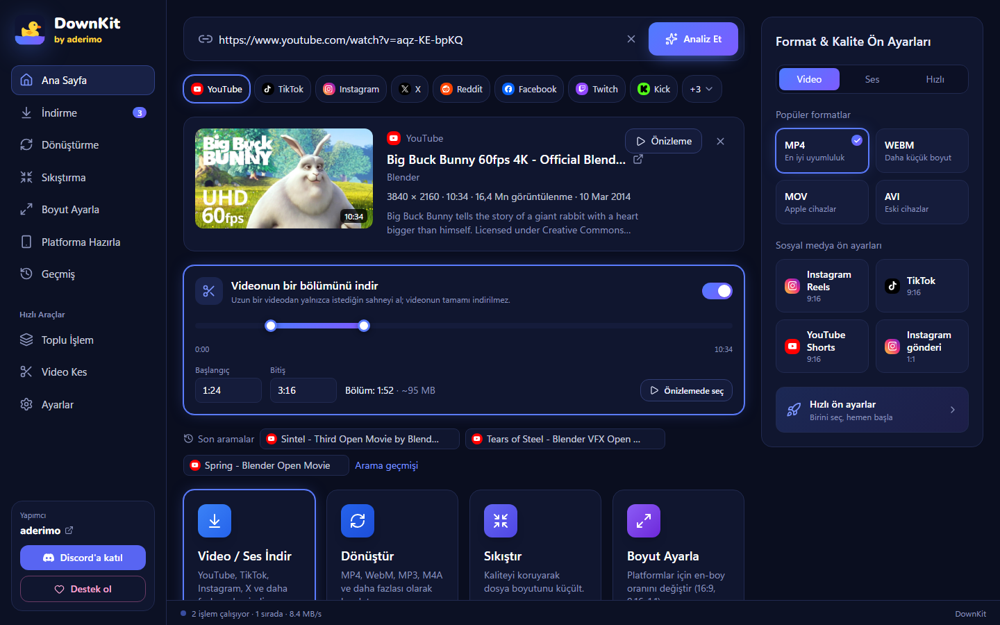
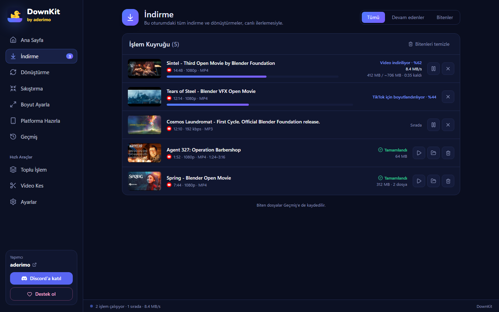
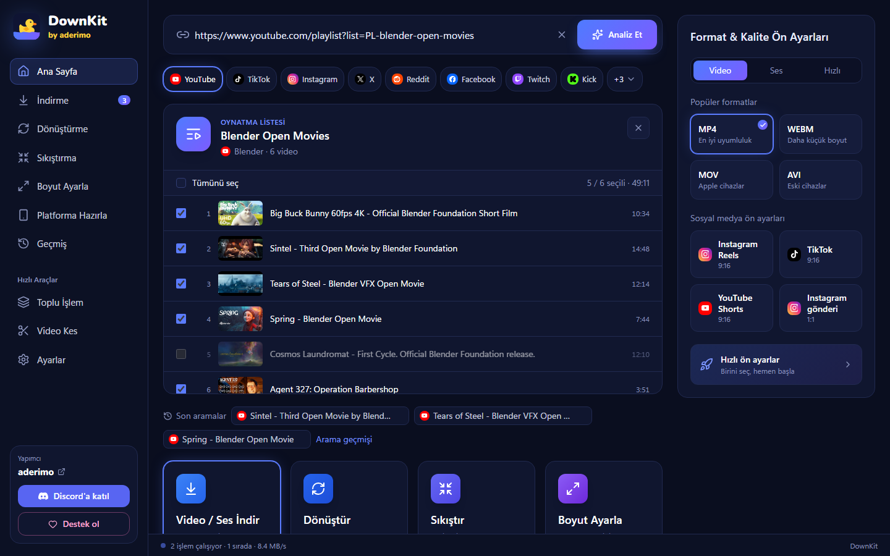
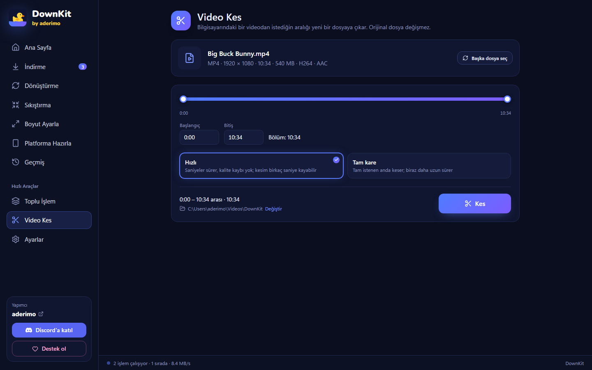
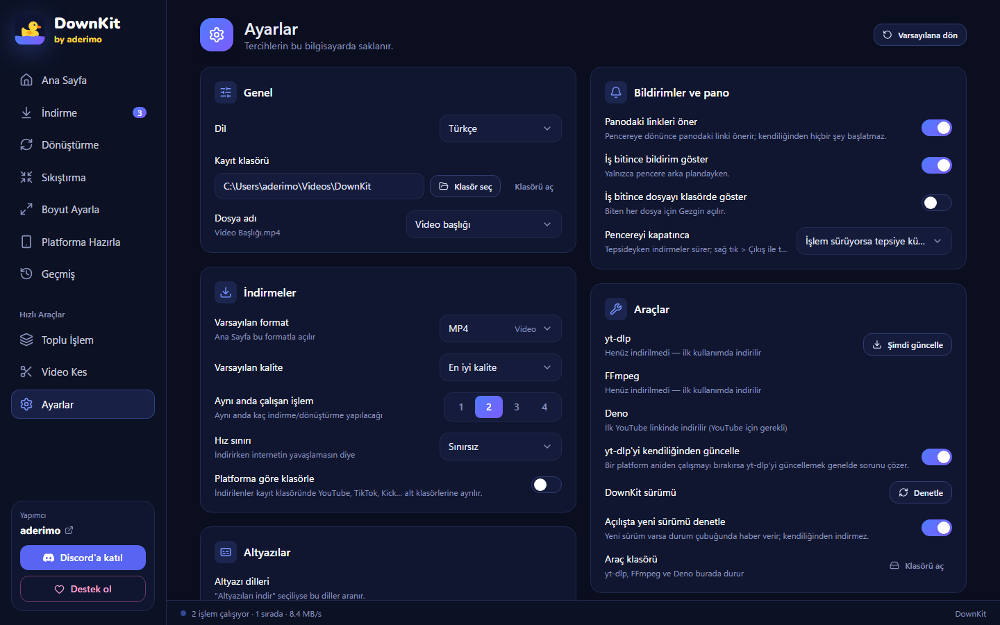

<div align="center">


# DownKit

**İndir. Dönüştür. Sıkıştır. Hazırla.**

[](../../releases)
[](LICENSE)
[](#kurulum)
[](https://discord.gg/z72EaBazJG)

Windows için ücretsiz ve açık kaynak medya aracı. YouTube, TikTok, Instagram, X, Kick ve
daha fazlasından link yapıştır; tam istediğin dosyayı al — **1 saatlik bir videonun sadece
bir sahnesini** bile.

[English](README.md) · **Türkçe**

</div>



---

## Neden

Çoğu indirici sana "bir video dosyası" verir. Sonra üç ayrı araç daha gerekir: istediğin
kısmı kesmek için, Discord'a sığacak kadar küçültmek için, TikTok için dikey yapmak için.
DownKit hepsini tek yerde yapar; codec, bit hızı ya da komut satırı bilmeden:

- **Sadece istediğin kısmı indir** — 1 saatlik videonun 1:24–3:16 arasını seç; gerisi hiç indirilmez.
- **Platforma hazır** — tek tıkla TikTok, Reels ya da Shorts için 1080×1920 kopya.
- **Paylaşmaya uygun boyut** — Discord'un 10 MB sınırına sığan sıkıştırılmış kopya.
- **Dürüst ilerleme** — yüzde, hız, boyut ve kalan süre; aşama aşama.

Sonsuza kadar ücretsiz. Reklam yok, hesap yok, veri toplama yok.

---

## Kurulum

### Gereksinimler

|                 |                                                       |
| --------------- | ----------------------------------------------------- |
| İşletim sistemi | Windows 10 veya 11 (64 bit)                           |
| WebView2        | Windows 10/11 ile zaten geliyor                       |
| İnternet        | İlk açılışta araçları indirmek için gerekli (aşağıda) |

### Adımlar

1. [Releases](../../releases) sayfasını aç ve şunlardan **birini** indir:
   - **`DownKit-Setup.exe`** — kurulum dosyası (Windows diline göre Türkçe ya da İngilizce).
     Yalnızca senin kullanıcına kurar, **yönetici izni istemez**; son sayfada
     **Masaüstü kısayolu oluştur** onay kutusu var.
   - **`DownKit.exe`** — kurulumsuz: çift tıkla, açılır. Hiçbir şey kurulmaz.
2. Çalıştır.

> **"Windows bilgisayarınızı korudu" uyarısı mı çıktı?** Exe henüz dijital olarak
> imzalı değil; SmartScreen her yeni uygulamada bu uyarıyı gösterir. **Ek bilgi → Yine de
> çalıştır**'a tıkla. Kaynak kodun tamamı burada ve her sürüm bu depodan GitHub Actions ile derlenir.

### İlk açılışta ne olur

DownKit motorlarını içinde taşımaz ki hep güncel kalsınlar. İlk ihtiyaç anında onları
**resmi GitHub sürümlerinden** indirir (bir kereye mahsus, yaklaşık 245 MB):

| Araç                                            | Ne işe yarar                                                                                                    | Boyut  |
| ----------------------------------------------- | --------------------------------------------------------------------------------------------------------------- | ------ |
| [yt-dlp](https://github.com/yt-dlp/yt-dlp)      | Linkleri okur, medyayı indirir                                                                                  | 17 MB  |
| [FFmpeg](https://github.com/BtbN/FFmpeg-Builds) | Birleştirme, dönüştürme, sıkıştırma, kesme                                                                      | 187 MB |
| [Deno](https://github.com/denoland/deno)        | yt-dlp'nin YouTube için ihtiyaç duyduğu yardımcı; ilk YouTube linkinde indirilir, sağlama toplamıyla doğrulanır | 41 MB  |

yt-dlp birkaç günde bir kendini günceller (Ayarlar'dan kapatılabilir). Platformlar sık
değişir; indirmelerin çalışmaya devam etmesini sağlayan şey güncel bir yt-dlp'dir.

---

## Nasıl kullanılır

### 1 · Linki yapıştır

Linki kopyala ve Ana Sayfa'da **Ctrl+V**'ye bas (ya da kutuya yapıştırıp **Analiz Et**'e
bas). Başlık, kanal, süre, çözünürlük ve — platform izin veriyorsa — uygulama içi önizleme görünür.

> DownKit panoya kopyaladığın desteklenen linkleri fark edip önerir. Kendiliğinden hiçbir
> şey başlatmaz.

### 2 · Ne istediğini seç

- **Format:** MP4, WebM, MKV, MOV, AVI — ya da sadece ses: MP3, M4A, WAV, AAC, FLAC.
- **Kalite:** her seçeneğin yanında tahmini dosya boyutu yazar.
- Sağdaki **ön ayarlar:** en iyi kalite, MP3, küçük dosya, Discord'a uygun, TikTok'a hazır.
- İsteğe bağlı: altyazı, platformlar için dikey kopya, sıkıştırılmış kopya.

### 3 · (İsteğe bağlı) Videonun sadece bir bölümünü indir

**Videonun bir bölümünü indir**'i aç, iki tutamacı sürükle ya da zamanları yaz (`1:24`,
`1:02:03`). Daha kolayı: **Önizlemede seç** — videoyu oynat, istediğin anda
**Başlangıç = şu an** / **Bitiş = şu an**'a bas.

Dosya aralığın adıyla kaydedilir, örneğin `Video (01.24-03.16).mp4`; kesim tam karede yapılır.

### 4 · İndir

**İndir**'e (ya da **Enter**'a) bas. İş canlı ilerlemesiyle kuyruğa girer:



Bitince **Dosyayı aç** ve **Klasörde göster** düğmeleri çıkar. Pencere arka plandaysa Windows
bildirimi gelir. İndirmeleri duraklatıp devam ettirebilirsin; işlem sürerken programı
kapatırsan sistem tepsisine iner, yarım kalan indirmeler sonraki açılışta duraklatılmış olarak gelir.

### Oynatma listeleri

Liste linkini yapıştır, istediğin videoları işaretle:



### Bilgisayarındaki dosyalar

Dosyayı pencereye sürükle ya da kenar çubuğundaki araçları kullan:

- **Dönüştürme** — formatı değiştirir. Kodekler zaten uygunsa (ör. H.264 MKV → MP4) yeniden
  kodlamak yerine kopyalar: saniyeler sürer, kalite kaybı olmaz.
- **Sıkıştırma** — kalite seviyesine ya da MB cinsinden hedef boyuta göre. "Küçük dosya" ayrıca 720p / 30 fps'e iner.
- **Boyut Ayarla / Platforma Hazırla** — istediğin çözünürlük ya da en-boy oranı; doldurarak kırp ya da bantla sığdır.
- **Video Kes** — bilgisayardaki videodan bir aralık çıkarır: _Hızlı_ (saniyeler sürer, yeniden
  kodlamaz; kesim en yakın anahtar kareye birkaç saniye kayabilir) ya da _Tam kare_.



Orijinal dosya asla değişmez; sonuçlar yeni dosya olarak kaydedilir.

---

## Özellikler

**Linkten**

- YouTube, TikTok, Instagram, X, Reddit, Facebook, Twitch, Kick, Vimeo, Dailymotion, Pinterest — ve yt-dlp'nin desteklediği diğer yüzlerce site
- Videonun sadece bir bölümünü indirme (tutamaç, zaman kutuları ya da önizlemeyi izlerken işaretleme)
- Oynatma listeleri (liste başına 500 videoya kadar) ve toplu işlem (çok sayıda link; tekrarlar atlanır)
- Seçtiğin dillerde altyazı (`.srt`); platformun reddettiği bir altyazı videoyu durdurmaz
- Platform kopyaları (Reels, TikTok, Shorts 9:16 · YouTube 16:9 · Instagram gönderi 1:1) ve sıkıştırılmış kopyalar

**Kuyruk**

- Canlı yüzde, hız, inen / toplam boyut, kalan süre ve aşama (video → ses → birleştirme)
- Duraklat / devam et, iptal (yarım dosyalar temizlenir), tekrar dene
- Aynı anda 1–4 işlem ve isteğe bağlı hız sınırı
- Yeniden açılışta kaldığı yerden; işlem sürerken kapatınca tepsiye iner
- Görev çubuğunda ilerleme, arka planda biten iş için bildirim

**Diğer**

- Biten dosyaların ve aranan linklerin geçmişi
- Anlaşılır hata mesajları (gizli, yaş sınırlı, ülkede kapalı, istek sınırı, kanal yayında değil, disk dolu…)
- Varsayılan format ve kalite, dosya adı şablonu, isteğe bağlı platform klasörleri
- Türkçe ve İngilizce arayüz
- Tek pencere: DownKit'i tekrar açmak mevcut pencereyi öne getirir
- Yeni sürüm çıkınca haber verir (kendiliğinden hiçbir şey kurmaz)



---

## Sorun giderme

| Sorun                                                      | Sebep ve çözüm                                                                                                                 |
| ---------------------------------------------------------- | ------------------------------------------------------------------------------------------------------------------------------ |
| **"Windows bilgisayarınızı korudu"**                       | Exe henüz imzalı değil. **Ek bilgi → Yine de çalıştır.**                                                                       |
| **Bir site aniden çalışmayı bıraktı**                      | Platformlar sık değişir. **Ayarlar → Araçlar → yt-dlp → Şimdi güncelle.**                                                      |
| **"Platform çok fazla istek aldı"**                        | İstek sınırı (HTTP 429). Birkaç dakika bekle. Altyazıda sorun oluyorsa _Otomatik altyazıları da indir_'i kapat.                |
| **"Bu video gizli / yaş sınırlı / yalnızca üyelere açık"** | DownKit erişim kısıtlamalarını aşmaz — bu videolar indirilemez.                                                                |
| **"Bu kanal şu an yayında değil"** (Kick, Twitch)          | Bunun yerine geçmiş bir yayının (VOD) ya da klibin linkini yapıştır.                                                           |
| **İlk indirme geç başlıyor**                               | Araçlar bir kereye mahsus indiriliyor (≈245 MB).                                                                               |
| **Dosyalarım nerede?**                                     | **İndir** düğmesinin yanında yazan kayıt klasöründe ya da **Ayarlar → Kayıt klasörü**. Biten her işte **Klasörde göster** var. |
| **Kestiğim parça biraz erken başlıyor**                    | _Hızlı_ kesim anahtar karelerden keser. _Tam kare_'yi kullan.                                                                  |

Hâlâ takıldın mı? [Discord](https://discord.gg/z72EaBazJG)'da sor ya da [bir issue aç](../../issues).

---

## Gizlilik ve yasal

- Hesap yok, analiz yok, veri toplama yok. DownKit yalnızca linkini yapıştırdığın sitelerle
  ve GitHub'la (araçlarını indirmek ve yeni sürümü denetlemek için) konuşur.
- Ayarlar, geçmiş ve kuyruk senin bilgisayarında kalır.
- **DownKit DRM kırmaz ve erişim kısıtlamalarını aşmaz.** Yalnızca indirme hakkın olan ya da
  platformun koşullarının izin verdiği içerikleri indir. İndirdiklerinin sorumluluğu sana aittir.

---

## Destek ol

DownKit ücretsiz ve öyle kalacak. İşine yaradıysa ve teşekkür etmek istersen
**gönüllü bir bağışla** destek olabilirsin:

**[Bağış yap](https://donate.bynogame.com/aderimo)** · **[Discord](https://discord.gg/z72EaBazJG)** · **[aderimo](https://gitgit.me/aderimo)**

---

## Geliştirme

Gerekenler: [Node.js](https://nodejs.org/) 22+, [pnpm](https://pnpm.io/) (`corepack enable`),
[Rust](https://rustup.rs/) ve Windows'ta [Visual Studio Build Tools](https://visualstudio.microsoft.com/visual-cpp-build-tools/)
içinden _Desktop development with C++_.

```bash
pnpm install
pnpm tauri dev          # uygulamayı çalıştır
pnpm typecheck && pnpm lint && pnpm test && pnpm format:check
cd src-tauri && cargo test
```

Windows kısayolları: `baslat.bat` tüm kontrolleri çalıştırıp uygulamayı açar; `paketle.bat`
proje klasörüne `DownKit.exe` ve `DownKit-Setup.exe` üretir.

| Yol                       | Görevi                                                                          |
| ------------------------- | ------------------------------------------------------------------------------- |
| `src/`                    | React + TypeScript arayüz (ekranlar, iş motoru, `src/locales` içinde çeviriler) |
| `src-tauri/src/commands/` | Tauri komutları: analiz, indirme, dönüştürme, sıkıştırma, boyutlandırma, kesme  |
| `src-tauri/src/ytdlp/`    | yt-dlp, Deno ve anlaşılır hata eşlemesi                                         |
| `src-tauri/src/ffmpeg/`   | FFmpeg argüman kurucuları (saf fonksiyonlar, birim testli)                      |
| `branding/`               | İkon kaynağı (`icon.svg`) ve kurulum görselleri                                 |
| `docs/screenshots/`       | README ekran görüntüleri (geliştirme sunucusunda `?demo=home&lang=tr`)          |

Sürüm yayınlama: `v0.1.0` gibi bir etiket gönder; [sürüm iş akışı](.github/workflows/release.yml)
kurulum dosyasını ve kurulumsuz exe'yi derleyip taslak sürüme ekler.

Katkılara açığız. Bu depodaki yorumlar, commit mesajları ve testler Türkçe yazılır; issue ve
pull request'ler İngilizce de olabilir.

---

## Lisans

[MIT](LICENSE) — özgürce kullan, değiştir, yeniden dağıt.

DownKit bağımsız bir araçtır; [yt-dlp](https://github.com/yt-dlp/yt-dlp) (Unlicense),
[FFmpeg](https://ffmpeg.org/legal.html) (LGPL/GPL, ayrı bir program olarak çalıştırılır),
[Deno](https://github.com/denoland/deno) (MIT) ve [Tauri](https://tauri.app/) (MIT/Apache-2.0) üzerine kuruludur.
Marka ikonları [Simple Icons](https://simpleicons.org/) (CC0), yazı tipi
[Nunito](https://fonts.google.com/specimen/Nunito) (OFL).
Ekran görüntülerinde [Blender Foundation](https://studio.blender.org/films/)'ın açık filmleri (CC BY) görünür.

<div align="center">

Yapımcı · **[aderimo](https://gitgit.me/aderimo)**

</div>
